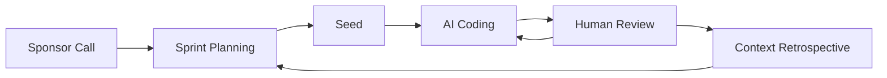

# Agile Vibe Coding (AVC)

**A framework for managing agent-based software development projects**


Agile Vibe Coding (AVC) is a structured approach to consistent long-term software development with AI. 


## The Challenge

Large software projects stress LLM-based coding in ways that differ fundamentally from how human development teams operate. Unlike humans, which retain long-term memory and build overall abstract understanding through iteration, LLMs do not have these capacities. 

- **LLMs are probabilistic and sensitive to prompt formulation**, leading to variability in outputs for semantically similar inputs.

- **LLM context should not be understood as memory but as transient information**, reprocessed statically at each generation step.

- **When context exceeds a model’s effective range, coherence and constraint adherence degrade** due to attention dilution and approximation.

- **The linear predictive nature of LLMs enforces sequential reasoning**, limiting explicit parallel deliberation and hypothesis comparison.

- **LLMs lack grounded understanding**, operating on learned token correlations rather than sensorimotor or experiential semantics.

- **Knowledge is bounded by training data and cutoff**, making models inherently outdated without external retrieval mechanisms.

- **Reasoning emerges from pattern completion rather than explicit inference**, making logical consistency unreliable under distribution shift.

- **Multi-step reasoning reliability decreases with depth**, as intermediate errors accumulate without internal self-verification.

- **LLMs cannot internally verify truth or correctness**, lacking an intrinsic notion of factuality or epistemic uncertainty.


Left unguided, AI coding agents drift. Context decays. Abstractions fracture. Logic duplicates. Regressions surface across independently generated features. 

These are not defects of the models, but natural consequences of bounded context, ephemeral reasoning, and probabilistic generation operating without the persistent internal understanding that humans develop over time.

Can we still build large, complex systems with LLMs despite these constraints? 

Yes. By shaping context, constraints, and verification through deliberate frameworks and disciplined practice, we guide LLMs toward coherent outcomes. Where models lack persistent understanding, we supply externalized knowledge through a framework: where reasoning is ephemeral, we anchor it in artifacts. 

Let's call it **the Agile Vibe Coding framework**.

## The Agile Vibe Coding Framework

AVC gets inspired by the [Agile Manifesto](https://agilemanifesto.org/) and the [Agile project management](https://www.atlassian.com/agile/project-management) best practices and defines a set of assets, ceremonies and tools for handling the common challenges of sustained software delivery using LLMs.

### Assets Hierarchy

The Assets Hierarchy establishes a structured folder architecture to organize work items, contextual scopes, and documentation supporting the tools and ceremonies defined within the Agile Vibe Coding framework.

```
project/
├── doc.md                                    # documentation
├── context.md                                # context scope                                                             
└── context-0001/   
    ├── doc.md                                # documentation                          
    ├── context.md                            # context scope
    ├── work.json                             # work item (e.g. EPIC)
    └── context-0001-0001/                    
        ├── doc.md                            # documentation                          
        ├── context.md                        # context scope
        ├── work.json                         # work item (e.g. STORY)                     
        └── context-0001-0001-0001/           
            ├── doc.md                        # documentation                          
            ├── context.md                    # context scope
            ├── work.json                     # work item (e.g. TASK)                     
            ├── context-0001-0001-0001-0001/  
            │   ├── doc.md                    # documentation
            │   ├── context.md                # context scope
            │   └── work.json                 # work item (e.g. SUBTASK)
            └── context-0001-0001-0001-0002/
                ├── ...
```

### Context Scope

A context scope (context.md) defines the minimal set of information required for an LLM to correctly implement a specific work item. It includes only the content that is directly relevant to that single item, ensuring the model operates with focused and sufficient context.

### Documentation Scope

A documentation item (doc.md) contains human-readable project documentation related to a specific work item. Its purpose is to provide developers with the necessary background, explanations, and reference material associated with that item.

### Work Item

Work items defines what needs to get done and the list of tests for its work validation.

```json
{
  "id": "context-0001-0001-0001-0001",
  "name": "Create JWT Payload Interface",
  "dependencies": [],
  "prompt": "Create TypeScript interface for JWT payload in src/types/JWTPayload.ts. Include properties: userId (string), email (string), role ('user' | 'admin' literal type), exp (number), iat (number). Add JSDoc comments. Export as named interface.",
  "statuses": [{
    "status": "pending",
    "timestamp": 1769442717798
  }],
  "validation": {
    "status": "pending",
    "tests": [{
      "status": "pending",
      "testPrompt": "Verify JWTPayload interface is properly exported with all required properties and correct types.",
      "validations": [{
        "criteria": "Interface exported from src/types/JWTPayload.ts",
        "status": "pending"
      }, {
        "criteria": "All 5 properties exist with correct types",
        "status": "pending"
      }, {
        "criteria": "TypeScript compiles without errors",
        "status": "pending"
      }]
    }],
    "allTestsPassed": false
  },
  "completedAt": null
}
```


#### Work Items Flow

Work items are implemented bottom-up in the tree.
Start with the smallest, most concrete tasks (leaf nodes). Once those are done and validated, move up to their parents.

If it has children, it waits.

**Implementation Rules**

1. **Start at the bottom**
   - Begin with the deepest atomic tasks (leaf nodes).
   - Tasks should be small, self-contained, and testable.

2. **Parents wait for children**
   - A parent work item cannot start until:
     - All child items are marked `completed`
     - All related tests are passing
   - No partial roll-ups.

3. **Parallel work — with limits**
   - Parallel implementation is allowed only for **sibling nodes**.
   - Do not parallelize across dependency chains.
   - If two items depend on each other (directly or indirectly), they must be executed sequentially.


**Example execution order**

```
context-0001/                          # Epic
├── context-0001-0001/                 # Story
│   ├── context-0001-0001-0001/        # Task
│   │   ├── context-0001-0001-0001-0001/  ← 1. Implement first (atomic subtask)
│   │   └── context-0001-0001-0001-0002/  ← 1. Parallel with sibling -0001
│   │   # Task starts only after both subtasks complete ↑
│   └── context-0001-0001-0002/        ← 2. Parallel with sibling task -0001
│   # Story starts only after both tasks complete ↑
└── context-0001-0002/                 ← 2. Parallel with sibling story -0001
    # Epic completes only after both stories complete ↑
```

### Context Inheritance

Each level in the hierarchy includes its own `context.md` file.

Context is **hierarchically inherited**:
- Each level inherits the full context of its parent.
- It extends that context with more specific, local details relevant to its scope.

When implementing a work unit, agents must read **all `context.md` files along the path** — from the project root down to the current level.

This ensures:
- Awareness of global constraints
- Alignment with higher-level design decisions
- Access to all level-specific requirements

An example:

```
project/
├── doc.md                  # Level 1: Project documentation
├── context.md              # Level 1: Project  :: Language: TypeScript 5.0 [...]
└── context-0001/           # Epic
    ├── doc.md              # Level 2: Epic documentation
    ├── context.md          # Level 2: Epic     :: All passwords MUST be hashed [...]
    ├── work.json           # Epic work item
    └── context-0001-0001/  # Story
        ├── doc.md          # Level 3: Story documentation
        ├── context.md      # Level 3: Story    :: Password minimum 8 characters [...]
        ├── work.json       # Story work item
        └── context-0001-0001-0001/  # Task
            ├── doc.md      # Level 4: Task documentation
            ├── context.md  # Level 4: Task     :: pattern -> class JWTService { [...]
            └── work.json   # Task work item
```

**When an agent implements task `context-0001-0001-0001`, it reads ALL five context.md files (project + epic + story + task) as the complete context.**


#### Validation Order

Testing follows the same bottom-up execution model as implementation:

1. **Subtask (Unit) tests must pass first.**
2. Once all subtask tests pass, run **Task (Integration) tests**.
3. Only when all task tests pass, run **Story (E2E) tests**.
4. Only when all stories pass, run **Epic (System) tests**.

No higher-level tests should run if lower-level tests are failing.

This ensures:
- Failures are caught at the smallest possible scope
- Debugging remains localized and efficient
- System-level validation reflects fully verified lower layers

## AVC Ceremonies

The Agile Vibe Coding framework gets inspired from the Agile project management ceremonies adding AI as a principal stakeholder (AI Agents and LLM models).



### **Sponsor Call**

The **Sponsor Call** ceremony is the foundational ceremony in the Agile Vibe Coding framework. It creates your project's brief and root context scope.

**[📖 Read /sponsor-call Documentation](ceremonies/sponsor-call.md)**


### **Sprint Planning**

Decomposes project scope into domain-based Epics and Stories with proper context.

**[📖 Read /spring-planning Documentation](ceremonies/sprint-planning.md)**


### **Seed**

Decomposes a Story into Tasks (2-5) and Subtasks (1-3 per Task) for implementation. Creates atomic work units with complete context inheritance from Story, Epic, and Project levels.

**Key Features**

- Story-level decomposition into technical Tasks
- Task categories: backend, frontend, database, testing, infrastructure
- Atomic Subtasks (1-4 hours each)
- Generates Task and Subtask context.md files
- Updates Story work.json with Task children

**Output**

- Task directories: `context-XXXX-XXXX-XXXX/` with doc.md, context.md, work.json
- Subtask directories: `context-XXXX-XXXX-XXXX-XXXX/` with doc.md, context.md, work.json

**Usage**

`/seed <story-id>` (e.g., `/seed context-0001-0001`)

**[📖 Read Full Documentation](ceremonies/seed.md)**


### **AI Coding** - Implementation

**Status**

🚧 **Under Development**

Autonomous implementation of atomic work units by specialized AI agents. Generates code, tests, and documentation based on context from all parent levels.

**Key Features**

- Specialized agents (Server, Client, Infrastructure, Testing)
- Context-aware implementation
- Automated testing and validation
- Human review gate before completion

**[📖 Read Full Documentation](ceremonies/ai-coding.md)**


### **Context Retrospective** - Learning & Refinement

**Status**

🚧 **Under Development**

Updates all context scopes based on learnings from implementation. Ensures AI agents have accurate, up-to-date context for future work by capturing architectural decisions, domain knowledge, and technical insights.

**Key Features**

- Analyzes completed work for insights
- Updates context.md files at all levels
- Maintains context inheritance
- Tracks architectural decisions and patterns

**[📖 Read Full Documentation](ceremonies/context-retrospective.md)**


### **Kanban Board** - Work Item Visualization

**Status**

✅ **Production Ready**

Visual kanban board for managing AVC work items. Interactive web interface with real-time updates, filtering, grouping, and detailed work item views.

**Key Features**

- **5 Workflow Columns**: Backlog, Ready, In Progress, Review, Done
- **Real-time Updates**: WebSocket sync when work items change
- **Advanced Filtering**: By type (Epic/Story/Task/Subtask), status, and full-text search
- **Multiple Groupings**: View by Status, Epic hierarchy, or Type
- **Interactive Cards**: Click for full details with context, documentation, and children
- **Modern UI**: Built with React, shadcn/ui, Tailwind CSS, and Framer Motion

**Usage**

`/kanban` (alias: `/k`)

**[📖 Read Full Documentation](ceremonies/kanban.md)**


## Multi-Provider LLM Support

AVC supports **different LLM providers for each ceremony**, allowing you to optimize for cost, speed, or quality based on ceremony-specific requirements.

### Configuration

**File**

`.avc/avc.json`

```json
{
  "settings": {
    "ceremonies": [
      {
        "name": "sponsor-call",
        "provider": "claude",
        "defaultModel": "claude-sonnet-4-5-20250929"
      },
      {
        "name": "sprint-planning",
        "provider": "gemini",
        "defaultModel": "gemini-2.0-flash-exp"
      }
    ]
  }
}
```

### Supported Providers

- **Claude** (Anthropic) - Best for long-form documentation, complex reasoning, structured thinking
- **Gemini** (Google) - Fast and cost-effective for iteration-heavy tasks

### API Keys

Set in `.env` file:

```bash
# Claude (Anthropic)
ANTHROPIC_API_KEY=sk-ant-...

# Gemini (Google)
GEMINI_API_KEY=...
```

### Switching Providers

Edit `.avc/avc.json` to change the provider for any ceremony:

```json
{
  "ceremonies": [
    {
      "name": "sponsor-call",
      "provider": "gemini",  // Changed from "claude"
      "defaultModel": "gemini-2.0-flash-exp"
    }
  ]
}
```

Then ensure the corresponding API key is set in `.env`.


## **AI Agent Strategy: Single Prompt Approach**

AVC uses a **single prompt strategy** where agent instructions and task data are combined into one user message, rather than separating them into system instructions and user prompts.

**What is the Single Prompt Approach?**
- Agent role definitions (from `src/cli/agents/*.md` files) are prepended to task-specific data
- Both are sent together as a single user message to the LLM
- System instructions are reserved only for generic behavior (e.g., "return valid JSON")

**Why We Chose This Strategy**

1. **Research Evidence**: Studies show LLMs experience 40-80% performance degradation when combining knowledge retrieval with instruction-following in separate channels ([arXiv:2410.12972](https://arxiv.org/html/2410.12972v2)). Processing agent role and task data together in unified context eliminates this split-attention problem.

2. **Explicit Role Establishment**: By placing agent instructions FIRST in the prompt, the model fully internalizes its role before processing task data. This reduces role confusion and improves output consistency.

3. **Better Validation**: The model can reference agent rules throughout generation, leading to better adherence to constraints like output formats and domain-specific requirements.

4. **Provider Agnostic**: Works identically across Claude (Anthropic) and Gemini (Google) APIs without provider-specific workarounds.

5. **Empirical Results**: Testing showed significantly better Epic/Story decomposition and context generation quality compared to system instruction approach.

**AI Agent Templates** (`src/cli/agents/`):

**Generation Agents**

- `project-documentation-creator.md` - 9-section document structure, technology-specific output, hierarchical documentation
- `project-context-generator.md` - Project-level architectural context with technology stack and patterns
- `epic-story-decomposer.md` - Domain-driven design rules, Epic/Story decomposition strategy
- `feature-context-generator.md` - Epic/Story context generation with layered specificity

**Validator Agents (Quality Assurance):**
- `validator-documentation.md` - Reviews `doc.md` for structural coherence, completeness, and application flow clarity
- `validator-context.md` - Reviews `context.md` for technical depth, consistency, and best practices

Validators run automatically in Sponsor Call ceremony to iteratively improve generated artifacts through LLM-powered feedback loops (max 2 iterations per artifact).

**Implementation Pattern** (works for both Claude and Gemini):
```javascript
// Single prompt: Agent instructions + Task data
const fullPrompt = `${agentInstructions}\n\n${taskPrompt}`;

// Claude API - agent in user message, not system
await anthropic.messages.create({
  system: 'You are a helpful assistant that returns valid JSON.',  // Minimal generic behavior
  messages: [{ role: 'user', content: fullPrompt }]  // Agent role + task together
});

// Gemini API - agent in contents, not systemInstruction
await googleAI.models.generateContent({
  contents: fullPrompt,  // Agent role + task together
  generationConfig: { responseMimeType: 'application/json' }
});
```

**Trade-offs:**
- ✅ **Pro**: 40-80% improvement in instruction-following accuracy
- ✅ **Pro**: Better role consistency and validation adherence
- ✅ **Pro**: Provider-agnostic implementation
- ⚠️ **Con**: Higher resource usage per agent call
- ⚠️ **Con**: Instruction redundancy across multiple API calls

**Decision**: For complex ceremony tasks (project decomposition, context generation), the quality improvement justifies the approach.

**Context Accumulation**: Each AI suggestion uses all previously collected answers as context. The system builds understanding progressively - later suggestions are more informed than earlier ones.


## References

1. **Anthropic's Best Practices for Long-Running Agents** - [Effective Harnesses for Long-Running Agents](https://www.anthropic.com/engineering/effective-harnesses-for-long-running-agents) - Agents working across multiple context windows need structured environments with initializer agents to set up foundations and coding agents that maintain clean, documented code states for handoffs between sessions.

2. **Microservices Architecture** - [Microservices Patterns](https://microservices.io/patterns/microservices.html) - Structures applications as loosely coupled, deployable components organized around business capabilities, enabling teams to develop, test, and deploy services independently while maintaining system flexibility and scalability.

3. **Agile Manifesto** - [Agile Principles](https://agilemanifesto.org/principles.html) - Prioritizes delivering functional software rapidly while remaining responsive to changing customer needs through continuous collaboration and team empowerment.

4. **LLM Limitations Research** - [https://arxiv.org/html/2410.12972v2](https://arxiv.org/html/2410.12972v2) - Large language models exhibit significant weakness in combining knowledge and instruction-following, with performance drops of 40-80% when given simple answer-modifying instructions alongside knowledge tasks.


