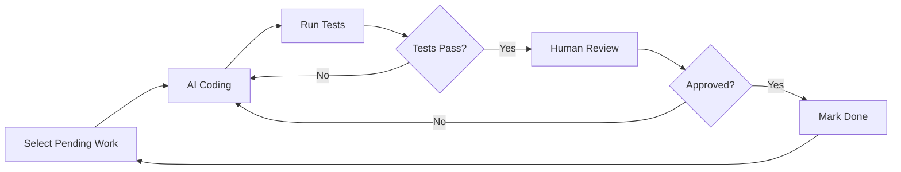

# AI Coding Ceremony

## Overview

The **AI Coding** ceremony is where AI agents implement individual work items (Tasks and Subtasks) based on the context and requirements defined in previous ceremonies.

**Purpose:** Autonomous implementation of atomic work units by specialized AI agents.

**Input:** Work items in "pending" status with complete context

**Output:** Implemented code, tests, and documentation with work items in "done" status


## How It Works

### Implementation Flow



### Process Steps

1. **Work Item Selection**
   - Query hierarchy for work items with status "pending"
   - Prioritize by dependencies (blocked items wait)
   - Select atomic work unit for implementation

2. **Context Loading**
   - Load context from all parent levels:
     - Project context (architecture, patterns)
     - Epic context (domain knowledge)
     - Story context (feature requirements)
     - Task context (technical details)

3. **AI Implementation**
   - Specialized agent implements the work item
   - Generates code following project patterns
   - Creates unit tests
   - Updates documentation

4. **Automated Testing**
   - Run generated tests
   - Verify acceptance criteria
   - Check code quality metrics

5. **Human Review Gate**
   - Developer reviews implementation
   - Approves or requests changes
   - Merges into codebase

6. **Status Update**
   - Mark work item as "done"
   - Update timestamps
   - Record metrics


## AI Agent Specialization

Different agents handle different types of work:

### Server Agent
**Responsibilities:**
- Backend API implementation
- Database schema and queries
- Business logic
- Server-side validation

**Technologies:** Node.js, Python, Java, etc.

### Client Agent
**Responsibilities:**
- Frontend components
- User interface logic
- Client-side validation
- State management

**Technologies:** React, Vue, Angular, etc.

### Infrastructure Agent
**Responsibilities:**
- Deployment configurations
- CI/CD pipelines
- Cloud resource provisioning
- Monitoring and logging setup

**Technologies:** Docker, Kubernetes, Terraform, etc.

### Testing Agent
**Responsibilities:**
- Unit test generation
- Integration test scenarios
- End-to-end test scripts
- Test data creation

**Technologies:** Jest, Pytest, Selenium, etc.


## Ceremony Output

### Per Work Item

```
.avc/project/epic-001/story-001-001/task-001-001-001/subtask-001-001-001-001/
├── doc.md              # Updated with implementation notes
├── context.md          # Unchanged (input)
├── work.json           # status: done, timestamps updated
├── implementation.md   # AI-generated implementation log
└── code/               # Generated code (linked to project repo)
    ├── src/
    ├── tests/
    └── _docs/
```

### Output Summary

- **Implemented Code** - Production-ready implementation
- **Tests** - Unit and integration tests
- **Documentation** - Implementation notes and API docs
- **Work Items** - Updated status (pending → done)


## Human Review Process

### Review Checklist

Developers review AI-generated code for:

**Code Quality:**
- [ ] Follows project coding standards
- [ ] Uses appropriate design patterns
- [ ] Handles edge cases properly
- [ ] Includes error handling

**Testing:**
- [ ] Tests cover acceptance criteria
- [ ] Tests are comprehensive
- [ ] Tests pass consistently

**Documentation:**
- [ ] Code is well-commented
- [ ] API documentation is clear
- [ ] Implementation notes are accurate

**Integration:**
- [ ] Works with existing codebase
- [ ] No conflicts with other features
- [ ] Follows architectural decisions

### Review Outcomes

- **Approve** - Merge and mark done
- **Request Changes** - Send back to AI with feedback
- **Reject** - Human implements (rare, indicates context issues)


## Metrics and Tracking

### Performance Metrics

- **Velocity** - Work items completed per sprint
- **Quality** - Test pass rate, code review approval rate
- **Efficiency** - Tokens used per work item
- **Success Rate** - Percentage of implementations approved on first try

### Dashboard

View metrics:
```bash
> /metrics
```


## Best Practices

### Context Quality
- Keep contexts updated via Context Retrospective
- Ensure contexts include examples
- Document architectural decisions clearly

### Work Item Sizing
- Keep work items truly atomic
- Split complex tasks further if needed
- Clear acceptance criteria for each item

### Review Efficiency
- Review code daily to prevent backlog
- Provide specific feedback for iterations
- Update contexts based on common review feedback


## Status

**Implementation Status:** 🚧 **Under Development**

This ceremony is planned for future release. Requires completion of Project Expansion first.


## See Also

- [Sponsor Call Ceremony](sponsor-call.md) - Creates project structure
- [Sprint Planning](sprint-planning.md) - Generates work items
- [Context Retrospective](context-retrospective.md) - Updates contexts based on learnings
