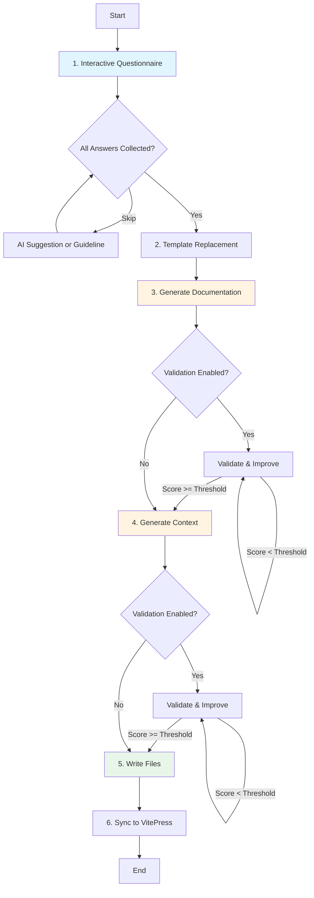

# Sponsor Call Ceremony

## Overview

The **Sponsor Call** ceremony is the foundational ceremony in the Agile Vibe Coding framework. It creates your project's blueprint through an AI-assisted questionnaire, generating comprehensive documentation and architectural context that guides all subsequent work.

**Purpose**

Establish project foundation with documentation (`doc.md`) and architectural context (`context.md`)

**Output**

Two files that serve as the single source of truth for your project

**Next Ceremony**

[`/project-expansion`](project-expansion.md) - Create Epics and Stories


## What It Does

The Sponsor Call ceremony:

1. **Collects Project Vision** - Interactive questionnaire with 5 core questions
2. **Generates Documentation** - AI creates professional 8-section project document
3. **Generates Context** - AI creates architectural context inherited by all work items
4. **Validates Quality** (optional) - AI validators iteratively improve output
5. **Syncs to VitePress** - Documentation auto-published to `.avc/documentation/index.md`

**What It Does NOT Do:**
- Does NOT create Epics or Stories (use `/project-expansion` for that)
- Does NOT create work.json files (use `/project-expansion` for that)
- Does NOT decompose features into hierarchy (use `/project-expansion` for that)


## Interactive Questionnaire

### The 5 Core Questions

| # | Question | Type | Purpose | Configurable |
|---|----------|------|---------|--------------|
| 1 | **Mission Statement** | Text | Core purpose and value proposition | ✅ |
| 2 | **Target Users** | Text | User types and their roles | ✅ |
| 3 | **Initial Scope** | Text | Key features, main workflows, essential capabilities | ✅ |
| 4 | **Technical Considerations** | Text | Technology stack, constraints, or preferences | ✅ |
| 5 | **Security & Compliance Requirements** | Text | Regulatory, privacy, or security constraints | ✅ |

### Answering Questions

**Input Methods**

- **Type your answer** - Multi-line input supported
  - Enter on empty line to submit
  - Supports line breaks and formatting
- **Skip (Enter twice)** - Uses guideline OR AI generates suggestion
  - First checks for configured guideline in `.avc/avc.json`
  - If no guideline, invokes domain-specific AI agent
  - AI uses context from previous answers

**Only Mission Statement is mandatory** - All others can be skipped safely

### AI Suggestion Agents

When you skip a question, specialized AI agents generate contextual suggestions:

| Question | Agent | Expertise | Output Format |
|----------|-------|-----------|---------------|
| Mission Statement | Business Analyst | Defining clear, compelling mission statements | 50-100 words following "Enable/Empower/Provide" pattern |
| Target Users | UX Researcher | Identifying user personas and roles | 2-4 distinct user types with role descriptions |
| Initial Scope | Product Manager | Defining features and prioritizing scope | 5-8 high-level features prioritized by importance |
| Technical Considerations | Technical Architect | Technology stack, architecture patterns, scalability | 100-200 words covering stack, architecture, scalability |
| Security & Compliance | Security Specialist | Security, privacy, compliance regulations | 150-250 words covering auth, data protection, compliance |

**Agent Files:**
- [`suggestion-business-analyst.md`](/agents/suggestion-business-analyst)
- [`suggestion-ux-researcher.md`](/agents/suggestion-ux-researcher)
- [`suggestion-product-manager.md`](/agents/suggestion-product-manager)
- [`suggestion-technical-architect.md`](/agents/suggestion-technical-architect)
- [`suggestion-security-specialist.md`](/agents/suggestion-security-specialist)


## Ceremony Workflow



### Stage 1: Interactive Questionnaire

**What happens:**
- Reads project template (`src/cli/templates/project.md`)
- Extracts 5 variables from template
- Presents each question with guidance
- Auto-saves progress every 30 seconds to `.avc/sponsor-call-progress.json`

**User options:**
- Type answer (multi-line supported)
- Press Enter twice to skip
- Edit previous answers (Ctrl+E in REPL)

**If question skipped:**
1. Check for guideline in `.avc/avc.json`
2. If found → use guideline value
3. If not found → invoke AI suggestion agent

### Stage 2: Template Replacement

**What happens:**
- Replaces `{{VARIABLE}}` placeholders with collected answers
- Formats lists as bullet points
- Creates initial markdown document

**No AI involved** - Simple string replacement

### Stage 3: Generate Documentation

**Agent**

[`project-documentation-creator.md`](/agents/project-documentation-creator)

**What happens:**
- Sends filled template to LLM
- Agent instructions guide LLM to create professional 8-section document
- Output: `.avc/project/doc.md`

**8 Sections Generated**

1. **Application Overview** - Mission, purpose, key objectives
2. **Target Users and Stakeholders** - User personas, roles, stakeholders
3. **Initial Scope** - Features and functional areas to implement
4. **Technical Considerations** - Technology stack, architecture, constraints
5. **Security and Compliance** - Security requirements, regulations, privacy
6. **User Workflows** - Primary user journeys and interactions
7. **Integration Requirements** - External systems, APIs, dependencies
8. **Success Criteria** - Metrics, KPIs, definition of done

### Stage 3b: Validation (Optional)

**Agent**

[`validator-documentation.md`](/agents/validator-documentation)

**What happens (if validation enabled):**
1. Validator scores documentation (0-100)
2. If score < threshold (default 75):
   - `documentation-improver` agent enhances document
   - Validator re-scores improved version
3. Repeat up to `maxIterations` (default 3)
4. Final document must meet threshold

**Configuration**

```json
{
  "ceremonies": [{
    "name": "sponsor-call",
    "validation": {
      "enabled": true,
      "maxIterations": 3,
      "acceptanceThreshold": 75,
      "skipOnCriticalIssues": false
    }
  }]
}
```

### Stage 4: Generate Context

**Agent**

[`project-context-generator.md`](/agents/project-context-generator)

**What happens:**
- Sends 5 questionnaire answers to LLM
- Agent instructions guide LLM to create architectural context
- Output: `.avc/project/context.md`

**Context Includes:**
- Technology stack and frameworks
- Cross-cutting concerns (auth, logging, error handling)
- Architecture principles and patterns
- Development standards and conventions

**Inheritance**

This context is inherited by all Epic/Story/Task/Subtask contexts created in later ceremonies

### Stage 4b: Validation (Optional)

**Agent**

[`validator-context.md`](/agents/validator-context)

**What happens (if validation enabled):**
- Same validation process as documentation
- Ensures context meets quality standards
- Iteratively improves if needed

### Stage 5: Write Files

**What happens:**
- Creates `.avc/project/` directory if not exists
- Writes `doc.md` to `.avc/project/doc.md`
- Writes `context.md` to `.avc/project/context.md`

**No AI involved** - Simple file I/O

### Stage 6: Sync to VitePress

**What happens:**
- Copies `doc.md` content to `.avc/documentation/index.md`
- Enables immediate documentation viewing with `/documentation` command
- Preserves VitePress-specific formatting

**No AI involved** - File copy operation


## Configuration

### LLM Provider & Model

**File**

`.avc/avc.json`

```json
{
  "settings": {
    "ceremonies": [
      {
        "name": "sponsor-call",
        "provider": "claude",
        "defaultModel": "claude-sonnet-4-5-20250929"
      }
    ]
  }
}
```

**Supported Providers**

- **claude** - Anthropic API
  - `claude-sonnet-4-5-20250929` (default, best balance)
  - `claude-opus-4-5-20251101` (most capable, higher cost)
  - `claude-haiku-4-20250514` (fastest, lowest cost)
- **gemini** - Google Generative AI
  - `gemini-2.5-flash-latest` (fast, low cost)
  - `gemini-2.5-pro-latest` (high capability)

### Configurable Guidelines

Pre-configure default answers for any question in `.avc/avc.json`. When you skip a question, AVC first checks for a guideline, then falls back to AI suggestion.

**Complete Configuration Example**

```json
{
  "settings": {
    "ceremonies": [
      {
        "name": "sponsor-call",
        "provider": "claude",
        "defaultModel": "claude-sonnet-4-5-20250929",
        "guidelines": {
          "missionStatement": "Your default mission statement here",
          "targetUsers": "Your default target users here",
          "initialScope": "Your default initial scope here",
          "technicalConsiderations": "Your default tech stack here",
          "securityAndComplianceRequirements": "Your default security requirements here"
        }
      }
    ]
  }
}
```

**Default Guideline (Pre-configured)**

Only `technicalConsiderations` has a default guideline out of the box:

```
Use AWS serverless stack with Lambda functions for compute,
API Gateway for REST APIs, DynamoDB for database, S3 for storage.
Use CloudFormation for infrastructure definition and
AWS CodePipeline/CodeBuild for CI/CD deployment.
```

All other questions default to AI-generated suggestions when skipped (unless you configure guidelines for them).

### Validation Configuration

Enable AI-powered iterative validation:

```json
{
  "settings": {
    "ceremonies": [
      {
        "name": "sponsor-call",
        "validation": {
          "enabled": true,
          "maxIterations": 3,
          "acceptanceThreshold": 75,
          "skipOnCriticalIssues": false
        }
      }
    ]
  }
}
```

**Parameters**

- `enabled` - Enable/disable validation (default: false)
- `maxIterations` - Max improvement cycles (default: 3)
- `acceptanceThreshold` - Minimum score 0-100 (default: 75)
- `skipOnCriticalIssues` - Stop if critical issues found (default: false)


## Ceremony Output

### Files Created

```
.avc/project/
├── doc.md              # 8-section project documentation
└── context.md          # Project-level architectural context

.avc/documentation/
└── index.md            # Auto-synced from doc.md (for VitePress)
```

### Files Updated

```
.avc/
└── ceremonies-history.json   # Ceremony execution history
```

### What's NOT Created

The following are created by the **`/project-expansion`** ceremony:
- Epic directories (`context-0001/`)
- Story directories (`context-0001-0001/`)
- Epic/Story `doc.md` files
- Epic/Story `context.md` files
- Epic/Story `work.json` metadata files


## Running the Ceremony

### Prerequisites

1. **Project Initialized**
   ```bash
   avc
   > /init
   ```

2. **API Key Configured** (in `.env` file)
   - For Claude: `ANTHROPIC_API_KEY=sk-ant-...`
   - For Gemini: `GEMINI_API_KEY=...`

### Execution

```bash
avc
> /sponsor-call
# or use alias:
> /sc
```

### Interactive Flow

1. **Questionnaire** (Stage 1)
   - Answer 5 questions
   - Press Enter twice to skip any question
   - Auto-saves progress every 30 seconds

2. **Processing** (Stages 2-7)
   - Watch progress updates:
     - Stage 4/5: Generating documentation...
     - Stage 5/5: Generating context...

3. **Completion**
   - View activity summary
   - Check token usage
   - Review generated files

### Progress & Resume

**Auto-Save**

- Every 30 seconds during questionnaire
- Saved to `.avc/sponsor-call-progress.json`

**Resume**

- If interrupted, next `/sponsor-call` detects incomplete progress
- Offers to resume from where you left off
- All previous answers preserved

**Manual Resume**

```bash
> /sponsor-call
# Detects incomplete progress
⚠️  Found incomplete ceremony from previous session
   Last activity: 2/5/2026, 10:30:45 AM
   Stage: questionnaire

Resume from where you left off? (y/n)
```


## Output Example

```
✅ Sponsor Call Completed

Activities performed:
• Collected 5 questionnaire answers
• Generated project documentation
• Generated project context
• Synced to VitePress documentation

Files created:
• .avc/project/doc.md
• .avc/project/context.md
• .avc/documentation/index.md

Next steps:
   1. Review .avc/project/doc.md for your project definition
   2. Run /documentation to view as website
   3. Run /project-expansion to create Epics and Stories
```


## Next Steps

After completing the Sponsor Call:

### 1. Review Generated Documents

**Project Documentation**

```bash
cat .avc/project/doc.md
```

**Project Context**

```bash
cat .avc/project/context.md
```

### 2. View as Website (Optional)

```bash
> /documentation
# Opens http://localhost:4173
```

### 3. Proceed to Next Ceremony

**Project Expansion** - Create Epics and Stories:
```bash
> /project-expansion
# or
> /pe
```

See [Project Expansion ceremony documentation](project-expansion.md)


## Troubleshooting

### Common Issues

**Issue**

"API key not set"

**Solution**

```bash
# Add to .env file
ANTHROPIC_API_KEY=sk-ant-your-key-here
```

**Issue**

"Rate limit exceeded"

**Solution**

- Wait 1-2 minutes and retry
- AVC includes automatic retry with exponential backoff
- For persistent issues, consider using a different model

**Issue**

"Invalid JSON response"

**Solution**

- Rare issue with LLM provider
- Retry the ceremony
- If persistent, check provider status page

**Issue**

"Permission denied writing files"

**Solution**

- Check `.avc/` directory permissions
- Ensure you have write access to project directory

### Debug Logs

View detailed ceremony logs:
```bash
cat .avc/logs/sponsor-call-*.log
```

Logs include:
- Full questionnaire responses
- LLM request/response details
- File write operations
- Error stack traces


## Technical Implementation

### Code Location

- **Main Logic:** `src/cli/template-processor.js`
  - `processTemplate()` - Main workflow orchestrator
  - `generateFinalDocument()` - Documentation generation
  - `generateProjectContextContent()` - Context generation
  - `iterativeValidation()` - Validation loop

- **Ceremony Entry:** `src/cli/init.js`
  - `sponsorCall()` - CLI entry point
  - `sponsorCallWithAnswers()` - REPL integration

- **REPL Integration:** `src/cli/repl-ink.js`
  - `runSponsorCall()` - REPL command handler
  - Questionnaire UI components

### AI Agents

**Suggestion Agents (Optional)**

- `src/cli/agents/suggestion-business-analyst.md`
- `src/cli/agents/suggestion-ux-researcher.md`
- `src/cli/agents/suggestion-product-manager.md`
- `src/cli/agents/suggestion-technical-architect.md`
- `src/cli/agents/suggestion-security-specialist.md`

**Core Ceremony Agents**

- `src/cli/agents/project-documentation-creator.md`
- `src/cli/agents/project-context-generator.md`

**Validation Agents (Optional)**

- `src/cli/agents/validator-documentation.md`
- `src/cli/agents/validator-context.md`

### Tests

- **Unit Tests:** `src/tests/unit/questionnaire.test.js`
- **Integration Tests:** `src/tests/integration/template-with-llm.test.js`


## See Also

- [Project Expansion Ceremony](project-expansion.md) - Create Epics and Stories
- [Seed Ceremony](seed.md) - Decompose Stories into Tasks/Subtasks
- [AI Coding Ceremony](ai-coding.md) - Implement work items
- [Context Retrospective](context-retrospective.md) - Update contexts with learnings
