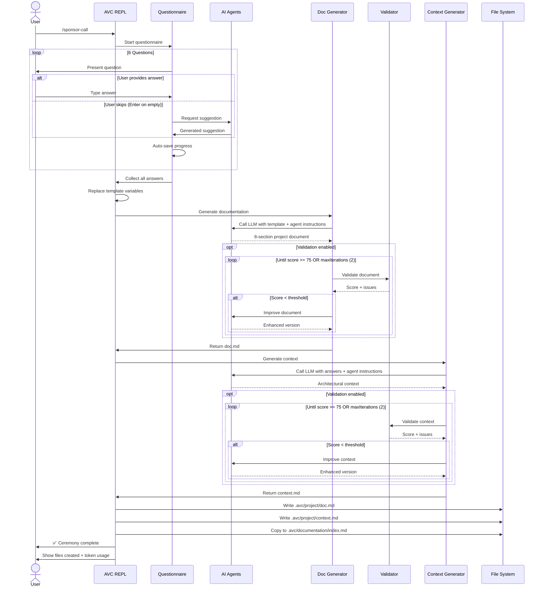

# Sponsor Call Ceremony

## Overview

The **Sponsor Call** ceremony is the foundational ceremony in the Agile Vibe Coding framework. It creates your project's brief and root context scope.

**Input**

Project team defined mission, scope and technical requirements.

**Output**

```
.avc/project/
├── doc.md              # project documentation
└── context.md          # root context scope
```

**Next Ceremony**

[`/sprint-planning`](sprint-planning.md) - Create Epics and Stories


## Ceremony Workflow

The Sponsor Call ceremony follows a  workflow that transforms user initial requirements into comprehensive project documentation (project brief) and a root context scope.



### Project Scope Gathering

The ceremony begins by asking the project team to define:

- The **mission statement**
- The **initial scope**
- Any additional **technical requirements** or **security constraints**


> **Only the Mission Statement is mandatory.**  
> If any other question is skipped, AI agents will generate structured suggestions that can be reviewed and edited later.

#### Scope Questionnaire

| # | Question | Purpose |
|---|----------|---------|
| 1 | **Mission Statement** | Defines the core purpose and value proposition of the project |
| 2 | Target Users | Identifies user types and their roles |
| 3 | Initial Scope | Outlines key features, primary workflows, and essential capabilities |
| 4 | Deployment Target | Specifies the intended deployment environment and infrastructure |
| 5 | Technical Considerations | Captures technology stack preferences, constraints, or requirements |
| 6 | Security & Compliance | Defines regulatory, privacy, and security obligations |

---

### Ceremony Agents

If a question is skipped, specialized agents generate structured proposals that can later be refined by the team.

| Agent | Purpose |
|-------|---------|
| [UX Researcher](/agents/suggestion-ux-researcher) | Generates target user suggestions |
| [Product Manager](/agents/suggestion-product-manager) | Proposes an initial feature scope |
| [Deployment Architect](/agents/suggestion-deployment-architect) | Suggests deployment environments and infrastructure |
| [Technical Architect](/agents/suggestion-technical-architect) | Recommends technology stack and architectural constraints |
| [Security Specialist](/agents/suggestion-security-specialist) | Proposes security and compliance requirements |


The collected answers are transformed into formal project artifacts using specialized AI agents for documentation:

| Agent | Purpose |
|-------|---------|
| [Documentation Creator](/agents/project-documentation-creator) | Converts questionnaire responses into a structured 8-section project document |
| [Documentation Validator](/agents/validator-documentation) | Scores and validates documentation quality (0–100 scale) |

and context creation:

| Agent | Purpose |
|-------|---------|
| [Context Generator](/agents/project-context-generator) | Generates architectural context from questionnaire inputs |
| [Context Validator](/agents/validator-context) | Scores and validates context quality (0–100 scale) |


## Next Steps

### Review Generated Documents

Review and update the project documentation and the initial context scope as needed.

**Project Documentation**

```bash
cat .avc/project/doc.md
```

> **Build and Launch Documentation Server**  
> Run the `/documentation` command to build and launch a local server for viewing human-oriented documentation.


**Project Context**

```bash
cat .avc/project/context.md
```

### Proceed to Next Ceremony

**Sprint Planning** - Create Epics and Stories:
```bash
> /sprint-planning
```

See [Sprint Planning ceremony documentation](sprint-planning.md)

## Troubleshooting

View detailed ceremony logs:
```bash
cat .avc/logs/sponsor-call-*.log
```

Logs include:
- Full questionnaire responses
- LLM request/response details
- File write operations
- Error stack traces
