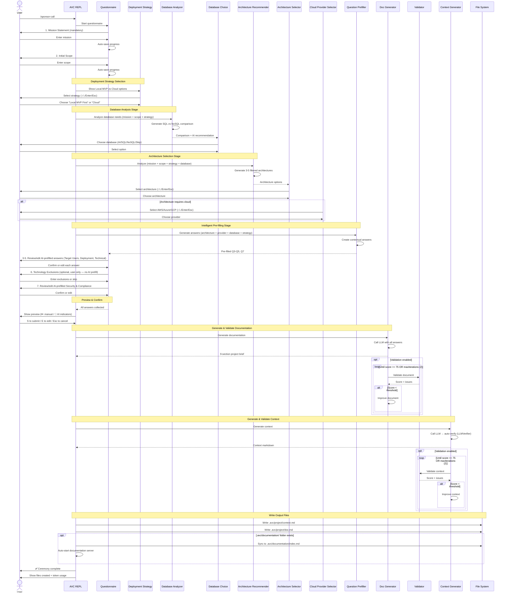

# Sponsor Call Ceremony

## Overview

The **Sponsor Call** ceremony is the foundational ceremony in the Agile Vibe Coding framework. It creates your project's brief and root context scope.

**Input**

Project team defined mission, scope and technical requirements.

**Output**

```
.avc/project/
├── doc.md              # project documentation
└── context.md          # root context scope
```

**Next Ceremony**

[`/sprint-planning`](sprint-planning.md) - Create Epics and Stories


## Ceremony Workflow

The Sponsor Call ceremony features an **architecture-aware workflow** that intelligently recommends deployment architectures and pre-fills technical questions based on your project requirements.


```mermaid
sequenceDiagram
    actor User
    participant REPL as AVC REPL
    participant QA as Questionnaire
    participant DepStrat as Deployment Strategy
    participant DBAnalyzer as Database Analyzer
    participant DBChoice as Database Choice
    participant ArchRec as Architecture Recommender
    participant ArchSel as Architecture Selector
    participant CloudSel as Cloud Provider Selector
    participant Prefill as Question Prefiller
    participant Doc as Doc Generator
    participant Val as Validator
    participant Ctx as Context Generator
    participant FS as File System

    User->>REPL: /sponsor-call
    REPL->>QA: Start questionnaire

    QA->>User: 1. Mission Statement (mandatory)
    User->>QA: Enter mission
    QA->>QA: Auto-save progress

    QA->>User: 2. Initial Scope
    User->>QA: Enter scope
    QA->>QA: Auto-save progress

    Note over REPL,DepStrat: Deployment Strategy Selection
    REPL->>DepStrat: Show Local MVP vs Cloud options
    DepStrat->>User: Select strategy (↑/↓/Enter/Esc)
    User->>DepStrat: Choose "Local MVP First" or "Cloud"

    Note over REPL,DBAnalyzer: Database Analysis Stage
    REPL->>DBAnalyzer: Analyze database needs (mission + scope + strategy)
    DBAnalyzer->>DBAnalyzer: Generate SQL vs NoSQL comparison
    DBAnalyzer-->>DBChoice: Comparison + AI recommendation

    DBChoice->>User: Choose database (AI/SQL/NoSQL/Skip)
    User->>DBChoice: Select option

    Note over REPL,ArchRec: Architecture Selection Stage
    REPL->>ArchRec: Analyze (mission + scope + strategy + database)
    ArchRec->>ArchRec: Generate 3-5 filtered architectures
    ArchRec-->>ArchSel: Architecture options

    ArchSel->>User: Select architecture (↑/↓/Enter/Esc)
    User->>ArchSel: Choose architecture

    alt Architecture requires cloud
        CloudSel->>User: Select AWS/Azure/GCP (↑/↓/Enter/Esc)
        User->>CloudSel: Choose provider
    end

    Note over REPL,Prefill: Intelligent Pre-filling Stage
    REPL->>Prefill: Generate answers (architecture + provider + database + strategy)
    Prefill->>Prefill: Create contextual answers
    Prefill-->>QA: Pre-filled Q3-Q5, Q7

    QA->>User: 3-5. Review/edit AI-prefilled answers (Target Users, Deployment, Technical)
    User->>QA: Confirm or edit each answer
    QA->>User: 6. Technology Exclusions (optional, user-only — no AI prefill)
    User->>QA: Enter exclusions or skip
    QA->>User: 7. Review/edit AI-prefilled Security & Compliance
    User->>QA: Confirm or edit

    Note over REPL,QA: Preview & Confirm
    QA-->>REPL: All answers collected
    REPL->>User: Show preview (✏️ manual / 🤖 AI indicators)
    User->>REPL: S to submit / E to edit / Esc to cancel

    Note over REPL,Doc: Generate & Validate Documentation
    REPL->>Doc: Generate documentation
    Doc->>Doc: Call LLM with all answers
    Doc-->>REPL: 9-section project brief

    opt Validation enabled
        loop Until score >= 75 OR maxIterations (2)
            Doc->>Val: Validate document
            Val-->>Doc: Score + issues
            alt Score < threshold
                Doc->>Doc: Improve document
            end
        end
    end

    Note over REPL,Ctx: Generate & Validate Context
    REPL->>Ctx: Generate context
    Ctx->>Ctx: Call LLM → auto-verify (LLMVerifier)
    Ctx-->>REPL: Context markdown

    opt Validation enabled
        loop Until score >= 75 OR maxIterations (2)
            Ctx->>Val: Validate context
            Val-->>Ctx: Score + issues
            alt Score < threshold
                Ctx->>Ctx: Improve context
            end
        end
    end

    Note over REPL,FS: Write Output Files
    REPL->>FS: Write .avc/project/context.md
    REPL->>FS: Write .avc/project/doc.md

    opt .avc/documentation/ folder exists
        REPL->>FS: Sync to .avc/documentation/index.md
        REPL->>REPL: Auto-start documentation server
    end

    REPL->>User: ✅ Ceremony complete
    REPL->>User: Show files created + token usage
```

### Project Scope Gathering

The ceremony begins by asking the project team to define:

- The **mission statement**
- The **initial scope**
- Any additional **technical requirements** or **security constraints**


> **Only the Mission Statement is mandatory.**
> If any other question is skipped, AI agents will generate structured suggestions that can be reviewed and edited later.

#### Scope Questionnaire

| # | Question | Status | Purpose |
|---|----------|--------|---------|
| 1 | **Mission Statement** | Manual (required) | Defines the core purpose and value proposition of the project |
| 2 | **Initial Scope** | Manual or AI-suggested | Outlines key features, primary workflows, and essential capabilities |
| 3 | Target Users | 🤖 AI-prefilled (editable) | Identifies end users and their roles based on **mission and scope only** |
| 4 | Deployment Target | 🤖 AI-prefilled (editable) | Specifies the deployment environment matching selected architecture and strategy |
| 5 | Technical Considerations | 🤖 AI-prefilled (editable) | Technology stack aligned with architecture, database, and deployment strategy |
| 6 | **Technology Exclusions** | Manual (optional) | Technologies, tools, or patterns explicitly excluded — user-driven, never AI-inferred |
| 7 | Security & Compliance Requirements | 🤖 AI-prefilled (editable) | Defines regulatory, privacy, and security obligations |

> **Important:** Target Users (Q3) represent the **end users of your application** (customers, admins, employees), NOT the developers building it. This is determined from your mission and scope, and is **not affected** by your deployment strategy choice.

---

## Deployment Strategy Selection

After answering the Mission Statement and Initial Scope, you'll be asked to choose your deployment approach. This strategic decision filters architecture and database recommendations to match your development goals.

### The Two Strategies

**🏠 Local MVP First**
- Build and validate your MVP on your local machine
- Zero cloud costs during development phase
- Run on localhost or Docker Compose
- Migrate to cloud when ready for production

**Best for:**
- Validating ideas before cloud investment
- Learning new technologies
- Budget-conscious projects
- Rapid prototyping and iteration

**☁️ Cloud Deployment**
- Deploy to production cloud infrastructure from day one
- AWS, Azure, or Google Cloud Platform
- Scalable managed services, production-ready
- Immediate global availability

**Best for:**
- Enterprise projects with immediate scale needs
- Production-ready from launch
- Leveraging managed cloud services
- High availability requirements

### How It Affects Recommendations

Your deployment strategy choice filters subsequent recommendations:

**Local MVP First:**
- Architecture options: Docker Compose setups, localhost configurations
- Database options: SQLite, local PostgreSQL/MongoDB in Docker
- Technical stack: Zero-cost local development tools
- Migration guide: Auto-generated with step-by-step cloud deployment instructions

**Cloud Deployment:**
- Architecture options: AWS ECS, Azure AKS, GCP Cloud Run, serverless
- Database options: RDS, DynamoDB, MongoDB Atlas, Cloud SQL
- Technical stack: Managed cloud services, auto-scaling, CDN
- Cost estimates: Included for each component

### Making Your Choice

```
🚀 Deployment Strategy

Choose how you want to deploy your application:

▶ Local MVP First
   Build and validate your MVP on your local machine
     • Zero cloud costs during development phase
     • Run on localhost or Docker Compose
     • Migrate to cloud when ready for production

   Best for: Validating ideas, learning, budget-conscious projects

  Cloud Deployment
   Deploy to production cloud infrastructure from day one
     • AWS, Azure, or Google Cloud Platform
     • Scalable managed services, production-ready
     • Immediate global availability

   Best for: Enterprise projects, immediate scale requirements

↑/↓: Navigate | Enter: Select | Esc: Skip (show all options)
```

**You can skip** deployment strategy selection (`Esc`) to see all architecture options regardless of deployment approach.

---

## Database Analysis & Selection

Based on your mission statement and scope, the AI analyzes your data storage needs and presents a comparison between SQL and NoSQL database approaches.

### How It Works

**1. AI Analysis**
   - Analyzes CRUD patterns in your scope
   - Evaluates data relationship complexity
   - Estimates read/write ratio
   - Considers deployment strategy context (local vs cloud)

**2. SQL vs NoSQL Comparison**
   - Presents both options with honest pros/cons
   - Shows cost estimates for each (local vs cloud)
   - Provides specific database recommendations
   - AI suggests the better fit based on analysis

**3. Your Choice**
   - 🤖 Let AI choose (uses AI recommendation)
   - 🟢 Choose SQL
   - 🔵 Choose NoSQL
   - ⏭️ Skip database analysis

### Example Comparison

```
📊 Database Options Comparison

Based on your project scope, here's the analysis:

SQL: PostgreSQL
✅ Pros:
  • ACID compliance ensures data integrity
  • Mature ecosystem with extensive tooling
  • Complex queries and joins are efficient
  • Strong consistency guarantees

❌ Cons:
  • Higher operational cost (~$150-200/month cloud)
  • Requires schema migrations for changes
  • Vertical scaling can be expensive

Best for: Applications with complex relationships and consistency requirements

NoSQL: MongoDB
✅ Pros:
  • Flexible schema for evolving data models
  • Horizontal scaling built-in
  • Lower cost for read-heavy workloads
  • Fast iteration during development

❌ Cons:
  • Limited query flexibility compared to SQL
  • Eventual consistency can complicate logic
  • Join operations are less efficient

Best for: Applications with flexible data models and high scalability needs

🤖 AI recommends: SQL (PostgreSQL)
Reasoning: Your scope mentions user accounts, permissions, and relational data
between tasks, comments, and attachments. PostgreSQL excels at these relationships.

Choose your database approach:
  🤖 Let AI choose (SQL - PostgreSQL)
  🟢 Choose SQL (PostgreSQL)
  🔵 Choose NoSQL (MongoDB)
  ⏭️  Skip database analysis

↑/↓: Navigate | Enter: Select
```

**Local MVP Strategy:** Database recommendations include local-friendly options (SQLite, Docker containers) with migration paths to cloud databases.

**Cloud Strategy:** Database recommendations focus on managed cloud services with cost estimates and production-ready configurations.

### When Database Analysis is Skipped

If your project doesn't require a database (e.g., static site, CLI tool), the AI may skip this stage automatically. You can also skip it manually by pressing `Esc`.

---

## Architecture Selection

After selecting your deployment strategy and database type, the ceremony automatically triggers an intelligent architecture recommendation stage that reduces ceremony time by ~60%.

### How It Works

**1. AI Analysis**
   - Architecture Recommender agent analyzes your mission, scope, deployment strategy, and database choice
   - Uses Claude Opus 4.6 for exceptional architectural reasoning
   - Filters architectures based on deployment strategy (local vs cloud)
   - Matches architectures to selected database type (SQL vs NoSQL)
   - Considers project complexity, features, scale, and requirements

**2. Architecture Options**
   - Presents 3-5 deployment architectures **filtered by your choices**
   - Each option includes:
     - **Name:** Clear, concise architecture identifier (e.g., "Docker Compose Full-Stack" or "AWS ECS Containerized")
     - **Description:** Infrastructure approach and key services (2-3 sentences)
     - **Best For:** When this option is optimal for your use case
   - Visual indicators:
     - ☁️ = Requires cloud provider selection (AWS/Azure/GCP)
     - 🌐 = Platform-agnostic or PaaS
     - 🏠 = Local development architecture (if Local MVP strategy chosen)

**3. Keyboard Navigation**
   - `↑/↓` arrows: Move between architecture options
   - `Enter`: Select architecture and proceed
   - `Esc`: Skip architecture selection (continue with manual questionnaire)

### Example Architecture Recommendations

For a task management application with team collaboration features:

```
🏗️  Recommended Deployment Architectures

Based on your mission and scope, here are 3 recommended approaches:

▶ ☁️ AWS Serverless Backend + React SPA
  Serverless API (Lambda + API Gateway) with React frontend on CloudFront.
  Scales automatically, pay-per-use pricing, minimal infrastructure management.
  Best for: Scalable multi-user applications with unpredictable traffic patterns

  🌐 Next.js Full-Stack on Vercel
  Next.js with Server Components and Vercel serverless functions.
  Zero-config deployment, excellent DX, built-in optimizations.
  Best for: Rapid development with modern framework and zero DevOps overhead

  🌐 Supabase Backend + React SPA
  JAMstack frontend with Supabase for database, auth, and realtime subscriptions.
  Managed Postgres, built-in auth, realtime features out-of-the-box.
  Best for: Fast iteration with managed backend services and realtime requirements

↑/↓: Navigate | Enter: Select | Esc: Skip (use manual answers)
```

### Cloud Provider Selection

If you select a cloud-based architecture (marked with ☁️), you'll be prompted to choose a cloud provider:

```
☁️  Select Cloud Provider for "AWS Serverless Backend + React SPA"

Your selected architecture requires a cloud provider. Choose one:

▶ 🟠 Amazon Web Services (AWS)
  Most comprehensive cloud platform with 200+ services and global reach.
  Services: Lambda, API Gateway, DynamoDB, S3, CloudFront, Cognito

  🔵 Microsoft Azure
  Strong .NET/Windows integration, excellent hybrid cloud capabilities.
  Services: Azure Functions, Cosmos DB, Azure CDN, Azure AD

  🔴 Google Cloud Platform (GCP)
  Cutting-edge data/ML services, strong Kubernetes and container support.
  Services: Cloud Functions, Firestore, Cloud CDN, Firebase Auth

↑/↓: Navigate | Enter: Select | Esc: Skip
```

**You can skip** cloud provider selection (`Esc`) to receive architecture-agnostic answers that don't reference specific cloud services.

### Question Pre-filling

After selecting architecture (and optionally cloud provider), the **Question Prefiller** agent generates contextual answers for the remaining questionnaire questions:

**Pre-filled Questions (Q3, Q4, Q5, Q7):**
1. **Target Users** - User personas, roles, and characteristics **based on mission and scope only** (NOT deployment strategy)
2. **Deployment Target** - Specific hosting platform and infrastructure matching architecture and deployment strategy
3. **Technical Considerations** - Tech stack, frameworks, database, scalability patterns aligned with all selections
4. **Security Requirements** - Auth, encryption, compliance inferred from architecture, database, and scope

**Not pre-filled (Q6):**
- **Technology Exclusions** — user-only field. Exclusions must be explicit user decisions and are never inferred by AI.

**Pre-filled answers are intelligent:**
- ✅ Align exactly with your selected architecture, deployment strategy, and database
- ✅ Include specific technologies and service names
- ✅ Reference your cloud provider if selected (e.g., "AWS Cognito for authentication")
- ✅ Match deployment strategy (local Docker setup vs cloud managed services)
- ✅ Include database-specific details (connection pooling, ORMs, migration tools)
- ✅ Infer requirements from scope (e.g., payments mentioned → PCI-DSS compliance)
- ✅ Match complexity to project maturity (MVP vs enterprise-scale)

**Target Users determination:**
- ✅ Inferred from mission statement and scope ONLY
- ❌ NOT affected by deployment strategy (local vs cloud)
- ✅ Represents end users of your application, not developers building it
- Example: "Task management for remote teams" → Users are remote team members, NOT developers

**You can edit any answer** before proceeding to documentation generation.

### Enhanced Preview

The preview screen shows all collected answers with visual indicators:

```
📋 Review Your Answers

Review the collected information before generating documentation.
🤖 = AI-suggested (you can edit these)

✏️ 1. Mission Statement
A collaborative task management platform for remote teams to coordinate
work across time zones with real-time updates and async communication.

✏️ 2. Initial Scope
Task creation, assignment, status tracking, team workspaces, real-time
notifications, comment threads, file attachments.

🤖 3. Target Users (AI-suggested)
Remote team managers coordinating distributed teams (5-50 members), individual
contributors tracking personal and team tasks, project coordinators managing
cross-functional initiatives.

🤖 4. Deployment Target (AI-suggested)
AWS cloud using serverless stack: Lambda functions for API (Node.js), API
Gateway for routing, DynamoDB for data storage, S3 + CloudFront for frontend
hosting, Cognito for authentication. React SPA hosted on CloudFront CDN.

Actions:
  E: Edit an answer | S: Submit and continue | Esc: Cancel
```

All answers remain **fully editable**. The AI suggestions serve as intelligent defaults that you can refine to match your specific requirements.

### Tips for Architecture Selection

**When to use architecture selection:**
- ✅ You're unsure about deployment options for your project type
- ✅ You want expert guidance on modern architecture patterns
- ✅ You're prototyping and need a quick, informed start
- ✅ You want to learn recommended approaches for your use case
- ✅ You're exploring different deployment strategies

**When to skip (press `Esc`):**
- ⏭️ You have strong opinions about your architecture
- ⏭️ Your project has unique constraints not captured in recommendations
- ⏭️ You prefer to manually define all technical details
- ⏭️ Your organization has mandatory architecture standards

**Editing AI suggestions:**
- Always review AI-prefilled answers before final submission
- AI recommendations are starting points, not mandates
- Edit to match your specific requirements, constraints, and preferences
- Technical stack suggestions can be swapped for alternatives (e.g., PostgreSQL instead of DynamoDB)

---

### Ceremony Agents

#### Architecture Selection Agents

Intelligent agents that analyze your project and provide expert architecture and database recommendations.

| Agent | Purpose | Location |
|-------|---------|----------|
| [Database Recommender](/agents/database-recommender) | Analyzes mission and scope to recommend SQL vs NoSQL with detailed comparison | `/agents/database-recommender` |
| [Architecture Recommender](/agents/architecture-recommender) | Analyzes mission, scope, and deployment strategy to recommend 3-5 filtered deployment architectures | `/agents/architecture-recommender` |
| [Question Prefiller](/agents/question-prefiller) | Generates contextual answers for Q3-Q6 based on selected architecture, database, and deployment strategy | `/agents/question-prefiller` |

#### Project Scope Agents

If a question is skipped (before architecture selection), specialized agents generate structured proposals.

| Agent | Purpose | Location |
|-------|---------|----------|
| [UX Researcher](/agents/suggestion-ux-researcher) | Generates target user suggestions | `/agents/suggestion-ux-researcher` |
| [Product Manager](/agents/suggestion-product-manager) | Proposes an initial feature scope | `/agents/suggestion-product-manager` |
| [Deployment Architect](/agents/suggestion-deployment-architect) | Suggests deployment environments and infrastructure | `/agents/suggestion-deployment-architect` |
| [Technical Architect](/agents/suggestion-technical-architect) | Recommends technology stack and architectural constraints | `/agents/suggestion-technical-architect` |
| [Security Specialist](/agents/suggestion-security-specialist) | Proposes security and compliance requirements | `/agents/suggestion-security-specialist` |

---

### Documentation & Context Generation

The collected answers are transformed into formal project artifacts using specialized AI agents.

#### Documentation Agents

| Agent | Purpose | Location |
|-------|---------|----------|
| [Documentation Creator](/agents/project-documentation-creator) | Converts questionnaire responses into a structured 9-section project brief | `/agents/project-documentation-creator` |
| [Documentation Validator](/agents/validator-documentation) | Scores and validates documentation quality (0–100 scale) | `/agents/validator-documentation` |

#### Context Agents

| Agent | Purpose | Location |
|-------|---------|----------|
| [Context Generator](/agents/project-context-generator) | Generates architectural context from questionnaire inputs | `/agents/project-context-generator` |
| [Context Validator](/agents/validator-context) | Scores and validates context quality (0–100 scale) | `/agents/validator-context` |


## Next Steps

After completing the Sponsor Call:

### Review Generated Documents

**Project Documentation** (`.avc/project/doc.md`)

Comprehensive 9-section project brief including:
- Overview
- Target Users
- Initial Scope
- User Workflows
- UI/UX Design
- Technical Architecture
- Integration Points
- Security & Compliance
- Success Metrics

```bash
cat .avc/project/doc.md
```

> **Tip:** Run `/documentation` to view as a formatted website

**Project Context** (`.avc/project/context.md`)

Architectural context file that guides all future AI agents:

```bash
cat .avc/project/context.md
```

**Migration Guide** (`.avc/DEPLOYMENT_MIGRATION.md`) - *Local MVP strategy only*

If you chose "Local MVP First", a comprehensive cloud migration guide is auto-generated:

```bash
cat .avc/DEPLOYMENT_MIGRATION.md
```

Includes:
- Current local stack summary
- When to migrate to cloud
- 3-4 cloud migration options with costs
- Step-by-step database migration
- Environment variables changes
- CI/CD pipeline examples
- Monitoring and observability setup
- Migration checklist

### Refine AI-Suggested Content

If you used architecture selection and question pre-filling:

1. **Review technical details** in `doc.md` for accuracy
2. **Verify cloud services** match your organization's approved list
3. **Check security requirements** align with your compliance needs
4. **Validate user personas** reflect your actual target audience

You can manually edit both files or re-run `/sponsor-call` with different selections.

### Proceed to Next Ceremony

**Sprint Planning** - Create Epics and Stories:
```bash
> /sprint-planning
```

See [Sprint Planning ceremony documentation](sprint-planning.md)

## Troubleshooting

View detailed ceremony logs:
```bash
cat .avc/logs/sponsor-call-*.log
```

Logs include:
- Full questionnaire responses
- LLM request/response details
- File write operations
- Error stack traces
