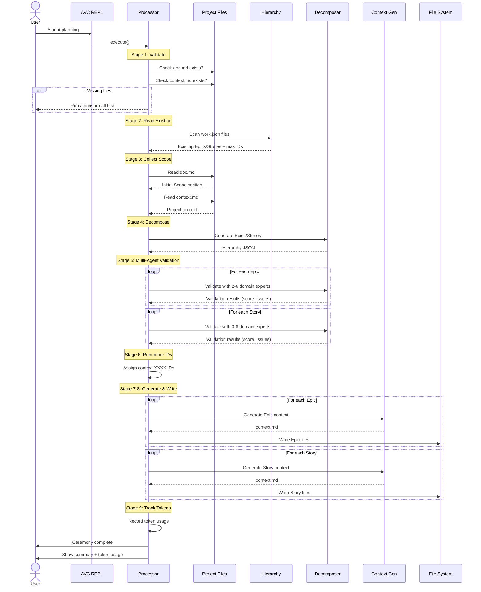

# Sprint Planning Ceremony

## Overview

The **Sprint Planning** ceremony decomposes your project scope into domain-based Epics and Stories with intelligent duplicate detection.

**Input**

- Project documentation (.avc/project/project/doc.md)
- Project context (.avc/project/project/context.md)
- Existing Epics/Stories (optional)

**Output**

```
.avc/project/
├── context-0001/              # Epic
│   ├── doc.md                 # Epic documentation stub
│   ├── context.md             # Epic context (~800 tokens)
│   └── work.json              # Epic metadata
└── context-0001-0001/         # Story
    ├── doc.md                 # Story documentation stub
    ├── context.md             # Story context (~1500 tokens)
    └── work.json              # Story metadata
```

**Next Ceremony**

[`/seed <story-id>`](seed.md) - Decompose Stories into Tasks and Subtasks


## Ceremony Workflow

The Sprint Planning ceremony reads your Initial Scope and project context, then uses AI agents to decompose it into Epics (3-7 domain groupings) and Stories (2-8 deliverable capabilities per Epic) with automatic duplicate detection.



### Scope Decomposition

The ceremony reads the Initial Scope from your project documentation and decomposes it into domain-based Epics and Stories.

**Prerequisite Validation**

Before decomposition, the ceremony verifies:
- Project documentation exists (`.avc/project/project/doc.md`)
- Project context exists (`.avc/project/project/context.md`)
- Initial Scope section is present in documentation

**Duplicate Detection**

The ceremony automatically:
- Scans existing Epic/Story work items
- Builds case-insensitive name maps
- Passes existing names to AI agents to prevent duplicates
- Renumbers IDs to avoid collisions

**Multi-Agent Validation**

After decomposition, each Epic and Story undergoes comprehensive validation:

**Epic Validation:**
- Routed to 2-6 specialized domain validators
- Checks: completeness, clarity, technical depth, consistency, best practices
- Displays: overall score (0-100), critical/major/minor issues, improvement priorities

**Story Validation:**
- Routed to 3-8 specialized domain validators
- Checks: acceptance criteria quality, implementation clarity, testability, scope
- Displays: overall score (0-100), issues with specific suggestions, estimated complexity

**Example Validation Output:**
```
🔍 Validating Epic: Foundation Services
   Domain: infrastructure
   Validators: 6 specialized agents

✅ Epic: Foundation Services
   Overall Score: 87/100
   Validators: 6 agents
   Issues: 0 critical, 2 major, 3 minor

🔍 Validating Story: User Registration
   Epic: Foundation Services (infrastructure)
   Validators: 8 specialized agents

⚠️  Story: User Registration
   Overall Score: 72/100
   Validators: 8 agents
   Issues: 1 critical, 3 major, 2 minor

   Critical Issues:
     • [security] Missing password strength requirements in acceptance criteria
       Fix: Specify password hashing algorithm (bcrypt, Argon2), salt strategy...
     • [qa] No test case for duplicate email registration
       Fix: Add acceptance criterion for duplicate email handling

   Improvement Priorities:
     1. Add password security specifications (2 validators)
     2. Add error scenario test cases (2 validators)
     3. Specify session management strategy (1 validator)

   ⚠️  Story will be created with validation warnings

✅ Validation complete
```

Work items are created even with validation warnings - you can review and address issues during implementation.

---

### Ceremony Agents

#### Decomposition Agent

The Initial Scope is decomposed into a hierarchical structure using AI-powered domain analysis.

| Agent | Purpose |
|-------|---------|
| [Epic/Story Decomposer](/agents/epic-story-decomposer) | Analyzes project scope and generates 3–7 domain-based Epics, each containing 2–8 Stories with duplicate detection |

#### Validation Agents (Multi-Agent System)

After decomposition, each Epic and Story is validated by 2-8 specialized domain experts to ensure completeness, clarity, and technical soundness.

**Epic Validators** (2-6 agents per epic)
- **Universal Validators** (always applied): Solution Architect, Developer (best practices), Security
- **Domain Validators**: DevOps, Database, Frontend, API, Cloud, QA, Test Architect, UX, UI, Mobile, Backend, Data
- **Feature Validators**: Based on epic features (e.g., authentication → security validator)

**Story Validators** (3-8 agents per story)
- **Universal Validators** (always applied): Developer, QA, Test Architect
- **Domain Validators**: Inherited from parent Epic domain
- **Feature Validators**: Based on epic features + inferred from acceptance criteria

**Validation Output:**
- ✅ **Excellent** (90-100): Comprehensive coverage, all best practices followed
- ⚠️  **Acceptable** (70-89): Core concerns addressed, minor gaps acceptable
- ❌ **Needs Improvement** (0-69): Critical gaps identified, warnings displayed

**What Validators Check:**
- **Completeness**: All domain-specific features and requirements identified
- **Clarity**: Terminology is clear and understandable
- **Technical Depth**: Architectural patterns, scalability, performance considerations
- **Consistency**: Requirements don't conflict, align with project context
- **Best Practices**: Industry standards followed, anti-patterns avoided

#### Context Generation Agents

Each Epic and Story receives a dedicated context file that inherits from the project context.

| Agent | Purpose |
|-------|---------|
| [Feature Context Generator](/agents/feature-context-generator) | Generates Epic context.md files (~800 tokens) with domain-specific patterns and architectural guidance |
| [Feature Context Generator](/agents/feature-context-generator) | Generates Story context.md files (~1500 tokens) with user journey details and acceptance criteria context |


## LLM Model Configuration

The Sprint Planning ceremony uses LLMs for three distinct stages. Configure models via `/models` command for cost and quality optimization.

### Stage Configuration

#### Stage 4: Decomposition
- **Purpose:** Generate Epics and Stories from project scope
- **Call count:** 1 per ceremony
- **Recommended:** Gemini 2.0 Flash (fast, cost-effective, excellent JSON generation)
- **Configure:** `/models` → Sprint Planning → Decomposition

#### Stage 5: Validation
- **Purpose:** Multi-agent validation with 2-8 domain experts per work item
- **Call count:** ~145 calls per ceremony (15 epic validators × ~3 epics + 15 story validators × ~8 stories)
- **Validation types:**
  - **Universal** - Always-applied (solution-architect, security, developer, qa, test-architect) → Use Claude Sonnet 4
  - **Domain** - Domain-specific (devops, database, frontend, api, backend, cloud, mobile, ui, ux, data) → Use Gemini 2.0 Flash
  - **Feature** - Inferred from keywords (varies per story) → Use Gemini 2.0 Flash
- **Configure:** `/models` → Sprint Planning → Validation → [Type]

#### Stage 7-8: Context Generation
- **Purpose:** Generate context.md files for each Epic and Story
- **Call count:** ~25 calls (~3 epics + ~22 stories)
- **Recommended:** Gemini 2.0 Flash (efficient, reliable context generation)
- **Configure:** `/models` → Sprint Planning → Context Generation

### Cost Optimization Example

**Default Configuration (all Claude Sonnet 4):**
```
170 calls × $0.025/call = ~$4.27 per ceremony
```

**Optimized Configuration:**
```json
{
  "sprint-planning": {
    "stages": {
      "decomposition": {
        "provider": "gemini",
        "model": "gemini-2.0-flash-exp"
      },
      "validation": {
        "provider": "gemini",
        "model": "gemini-2.0-flash-exp",
        "validationTypes": {
          "universal": {
            "provider": "claude",
            "model": "claude-sonnet-4-5-20250929"
          },
          "domain": {
            "provider": "gemini",
            "model": "gemini-2.0-flash-exp"
          },
          "feature": {
            "provider": "gemini",
            "model": "gemini-2.0-flash-exp"
          }
        }
      },
      "context-generation": {
        "provider": "gemini",
        "model": "gemini-2.0-flash-exp"
      }
    }
  }
}
```

**Cost Breakdown:**
```
Decomposition:       1 × $0.003   = $0.003
Universal Validation: 30 × $0.025  = $0.75   (critical validators)
Domain Validation:    90 × $0.003  = $0.27   (domain-specific)
Feature Validation:   25 × $0.003  = $0.075  (keyword-based)
Context Generation:   25 × $0.003  = $0.075  (epic + story contexts)
────────────────────────────────────────────
Total:                             ~$1.17 per ceremony (73% savings)
```

### Configuration Steps

1. **Run /models command:**
   ```bash
   > /models
   ```

2. **Select Sprint Planning ceremony**

3. **Configure each stage:**
   - Decomposition → Gemini 2.0 Flash
   - Validation → Select validation type:
     - Universal → Claude Sonnet 4 (highest quality for critical validators)
     - Domain → Gemini 2.0 Flash (efficient for domain checks)
     - Feature → Gemini 2.0 Flash (fast for keyword-based validation)
   - Context Generation → Gemini 2.0 Flash

4. **Configuration is saved to `.avc/avc.json`**

**Manual Configuration:**

Edit `.avc/avc.json` directly:
```json
{
  "settings": {
    "ceremonies": [
      {
        "name": "sprint-planning",
        "provider": "claude",
        "defaultModel": "claude-sonnet-4-5-20250929",
        "stages": {
          "decomposition": {
            "provider": "gemini",
            "model": "gemini-2.0-flash-exp"
          },
          "validation": {
            "provider": "gemini",
            "model": "gemini-2.0-flash-exp",
            "validationTypes": {
              "universal": {
                "provider": "claude",
                "model": "claude-sonnet-4-5-20250929"
              },
              "domain": {
                "provider": "gemini",
                "model": "gemini-2.0-flash-exp"
              },
              "feature": {
                "provider": "gemini",
                "model": "gemini-2.0-flash-exp"
              }
            }
          },
          "context-generation": {
            "provider": "gemini",
            "model": "gemini-2.0-flash-exp"
          }
        }
      }
    ]
  }
}
```


## Next Steps

### Review Generated Hierarchy

**Epic Structure**
```bash
cat .avc/project/context-0001/context.md
cat .avc/project/context-0001/work.json
```

**Story Structure**
```bash
cat .avc/project/context-0001-0001/context.md
cat .avc/project/context-0001-0001/work.json
```

### Proceed to Next Ceremony

**Seed** - Decompose a Story into Tasks and Subtasks:
```bash
> /seed context-0001-0001
```

See [Seed ceremony documentation](seed.md)


## Troubleshooting

View detailed ceremony logs:
```bash
cat .avc/logs/sprint-planning-*.log
```

Logs include:
- Existing hierarchy scan results
- Initial Scope extraction
- LLM decomposition request/response
- Context generation for each Epic/Story
- File write operations
- Error stack traces
