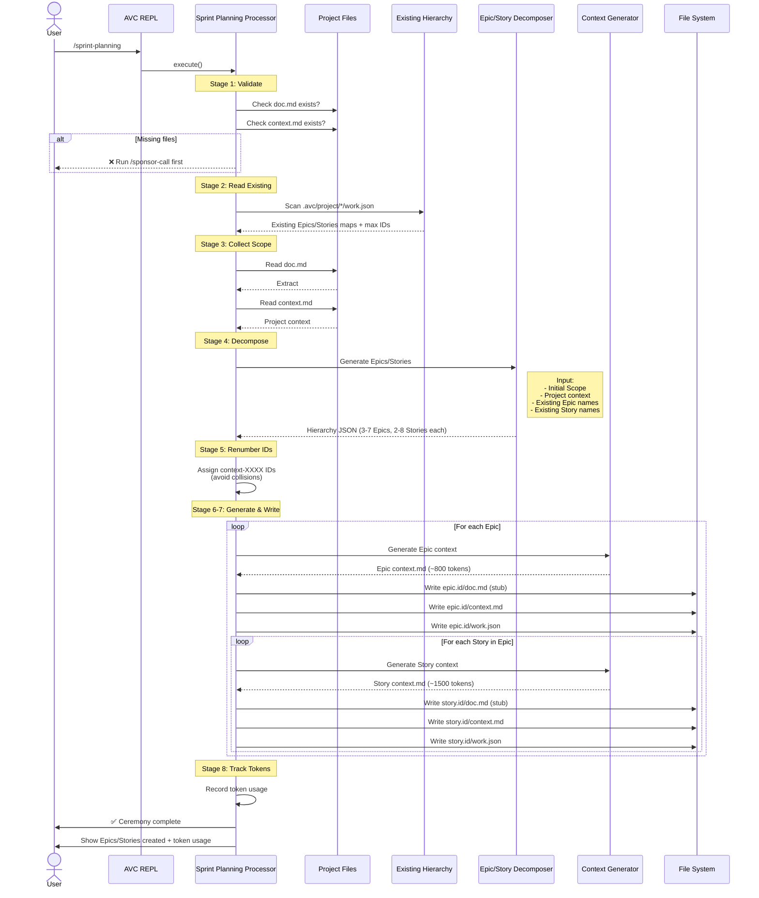

# Sprint Planning Ceremony

## Overview

The **Sprint Planning** ceremony decomposes your project scope into domain-based Epics and user-facing Stories with intelligent duplicate detection.

**Input**

- Project documentation (.avc/project/project/doc.md)
- Project context (.avc/project/project/context.md)
- Existing Epics/Stories (optional)

**Output**

```
.avc/project/
├── context-0001/              # Epic
│   ├── doc.md                 # Epic documentation stub
│   ├── context.md             # Epic context (~800 tokens)
│   └── work.json              # Epic metadata
└── context-0001-0001/         # Story
    ├── doc.md                 # Story documentation stub
    ├── context.md             # Story context (~1500 tokens)
    └── work.json              # Story metadata
```

**Next Ceremony**

[`/seed <story-id>`](seed.md) - Decompose Stories into Tasks and Subtasks


## Ceremony Workflow

The Sprint Planning ceremony reads your Initial Scope and project context, then uses AI agents to decompose it into Epics (3-7 domain groupings) and Stories (2-8 user capabilities per Epic) with automatic duplicate detection.



### Workflow Details

The ceremony executes through 8 stages:

**1. Validate Prerequisites**
- Verifies `.avc/project/project/doc.md` exists (contains Initial Scope)
- Verifies `.avc/project/project/context.md` exists (for context inheritance)
- Fails with error if Sponsor Call not completed

**2. Read Existing Hierarchy**
- Scans `.avc/project/` for existing `work.json` files
- Builds maps of existing Epic/Story names (case-insensitive)
- Tracks maximum ID numbers to avoid collisions

**3. Collect Scope**
- Extracts `## Initial Scope` section from project doc.md
- Reads project context.md for agent instructions

**4. Decompose with AI**
- Calls [epic-story-decomposer](/agents/epic-story-decomposer) agent
- Passes existing Epic/Story names for duplicate detection
- Generates 3-7 domain-based Epics
- Generates 2-8 user-facing Stories per Epic
- Skips duplicates automatically

**5. Renumber IDs**
- Assigns `context-XXXX` IDs to new Epics
- Assigns `context-XXXX-XXXX` IDs to new Stories
- Ensures no collisions with existing IDs

**6-7. Generate Contexts & Write Files**
- For each Epic:
  - Calls [feature-context-generator](/agents/feature-context-generator) agent
  - Generates Epic context.md (~800 tokens)
  - Writes doc.md (stub), context.md, work.json
- For each Story:
  - Calls feature-context-generator agent with Epic + Project context
  - Generates Story context.md (~1500 tokens)
  - Writes doc.md (stub), context.md, work.json

**8. Track Tokens**
- Records token usage to `.avc/tokens.json`
- Displays summary to user


## Next Steps

After completing Sprint Planning:

### Review Generated Hierarchy

**Epic Structure**
```bash
cat .avc/project/context-0001/context.md
cat .avc/project/context-0001/work.json
```

**Story Structure**
```bash
cat .avc/project/context-0001-0001/context.md
cat .avc/project/context-0001-0001/work.json
```

### Proceed to Next Ceremony

**Seed** - Decompose a Story into Tasks and Subtasks:
```bash
> /seed context-0001-0001
```

See [Seed ceremony documentation](seed.md)


## Troubleshooting

View detailed ceremony logs:
```bash
cat .avc/logs/sprint-planning-*.log
```

Logs include:
- Existing hierarchy scan results
- Initial Scope extraction
- LLM decomposition request/response
- Context generation for each Epic/Story
- File write operations
- Error stack traces
