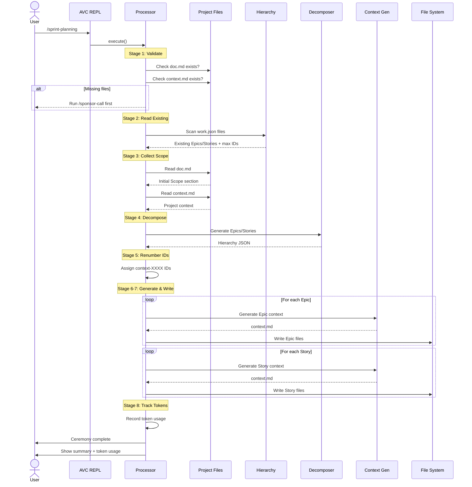

# Sprint Planning Ceremony

## Overview

The **Sprint Planning** ceremony decomposes your project scope into domain-based Epics and Stories.

**Input**

- Project documentation (.avc/project/project/doc.md)
- Project context (.avc/project/project/context.md)
- Existing Epics/Stories (optional)

**Output**

```
.avc/project/
├── context-0001/              # Epic
│   ├── doc.md                 # Epic documentation stub
│   ├── context.md             # Epic context (~800 tokens)
│   └── work.json              # Epic metadata
└── context-0001-0001/         # Story
    ├── doc.md                 # Story documentation stub
    ├── context.md             # Story context (~1500 tokens)
    └── work.json              # Story metadata
```

**Next Ceremony**

[`/seed <story-id>`](seed.md) - Decompose Stories into Tasks and Subtasks


## Ceremony Workflow

The Sprint Planning ceremony reads your Initial Scope and project context, then uses AI agents to decompose it into Epics and Stories.



### Scope Decomposition

The ceremony reads the Initial Scope from your project documentation and decomposes it into domain-based Epics and Stories.

**Prerequisite Validation**

Before decomposition, the ceremony verifies:
- Project documentation exists (`.avc/project/project/doc.md`)
- Project context exists (`.avc/project/project/context.md`)

**Duplicate Detection**

The ceremony automatically:
- Scans existing Epic/Story work items
- Builds case-insensitive name maps
- Passes existing names to AI agents to prevent duplicates
- Renumbers IDs to avoid collisions


### Ceremony Agents

The Initial Scope is decomposed into a hierarchical structure using AI-powered domain analysis.

| Agent | Purpose |
|-------|---------|
| [Epic/Story Decomposer](/agents/epic-story-decomposer) | Analyzes project scope and generates 3–7 domain-based Epics, each containing 2–8 Stories with duplicate detection |


Each Epic and Story receives a dedicated context file that inherits from the project context.

| Agent | Purpose |
|-------|---------|
| [Feature Context Generator](/agents/feature-context-generator) | Generates Epic context.md files (~800 tokens) with domain-specific patterns and architectural guidance |
| [Feature Context Generator](/agents/feature-context-generator) | Generates Story context.md files (~1500 tokens) with user journey details and acceptance criteria context |


## Next Steps

### Review Generated Hierarchy

**Epic Structure**
```bash
cat .avc/project/context-0001/context.md
cat .avc/project/context-0001/work.json
```

**Story Structure**
```bash
cat .avc/project/context-0001-0001/context.md
cat .avc/project/context-0001-0001/work.json
```

### Proceed to Next Ceremony

**Seed** - Decompose a Story into Tasks and Subtasks:
```bash
> /seed context-0001-0001
```

See [Seed ceremony documentation](seed.md)


## Troubleshooting

View detailed ceremony logs:
```bash
cat .avc/logs/sprint-planning-*.log
```

Logs include:
- Existing hierarchy scan results
- Initial Scope extraction
- LLM decomposition request/response
- Context generation for each Epic/Story
- File write operations
- Error stack traces
