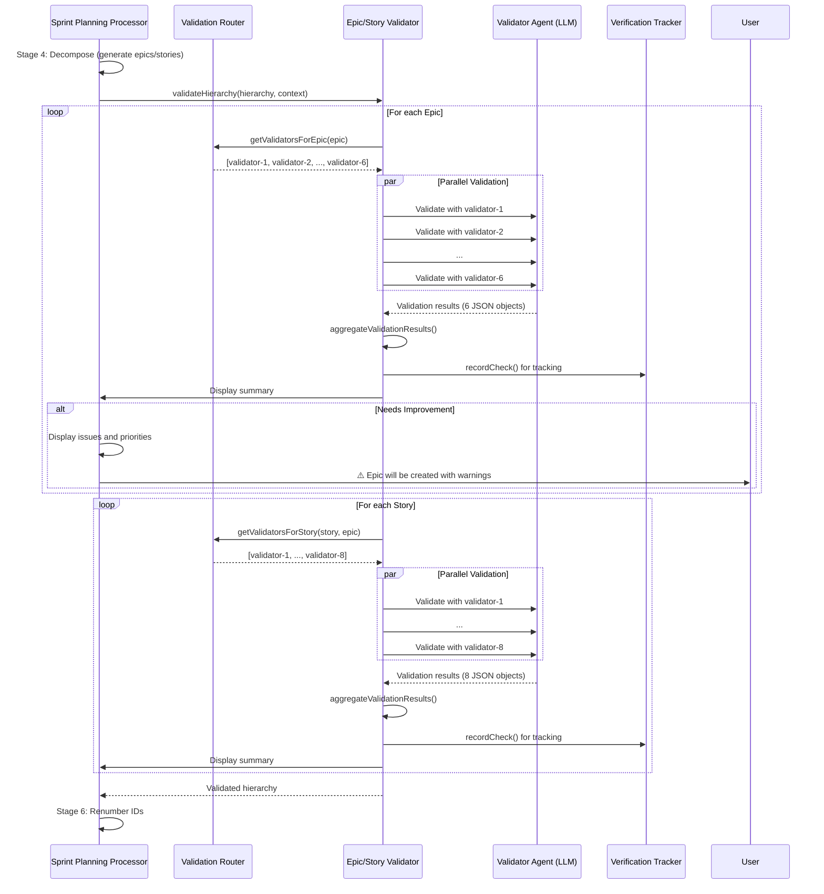

# Multi-Agent Validation Architecture

## Overview

The AVC Sprint Planning ceremony employs a multi-agent validation system that routes each Epic and Story to 2-8 specialized domain validators to ensure completeness, clarity, and technical soundness before work items are created.

## Architecture Components

### 1. Validation Router (`validation-router.js`)

The router determines which validators should review each work item based on:
- **Domain**: Epic/Story domain (infrastructure, user-management, frontend, etc.)
- **Features**: Explicit feature tags (authentication, database, testing, etc.)
- **Inferred Features**: Keywords detected in Story acceptance criteria

**Routing Strategy:**
```javascript
Epic → [Universal Validators] + [Domain Validators] + [Feature Validators]
Story → [Universal Validators] + [Inherited Domain] + [Feature Validators] + [Inferred Validators]
```

**Example Routing:**
```javascript
// Epic: Foundation Services (domain: infrastructure, features: [authentication, logging])
Validators: [
  'validator-epic-solution-architect',  // Universal
  'validator-epic-developer',           // Universal
  'validator-epic-security',            // Universal + Feature (authentication)
  'validator-epic-devops',              // Domain (infrastructure)
  'validator-epic-cloud',               // Domain (infrastructure)
  'validator-epic-backend'              // Domain (infrastructure)
]
// Total: 6 validators
```

### 2. Epic/Story Validator (`epic-story-validator.js`)

Orchestrates the validation workflow:

1. **Get Validators**: Query router for applicable validators
2. **Parallel Validation**: Run all validators concurrently
3. **Aggregate Results**: Combine scores, issues, strengths, priorities
4. **Determine Status**: Apply "highest severity wins" logic
5. **Display Results**: Show summary to user

**Aggregation Logic:**
- **Average Score**: Mean of all validator scores
- **Issue Categorization**: Critical/major/minor buckets
- **Strength Deduplication**: Remove similar strengths
- **Priority Ranking**: Sort by frequency across validators
- **Overall Status**: needs-improvement if ANY validator fails, excellent if ALL pass

### 3. Validator Agents (30 Epic + 30 Story = 60 total)

Each validator is defined by:
- **Agent Instructions** (`.md` file): Role, validation scope, checklist, issue categories, scoring guidelines, examples
- **Verification Rules** (`.json` file): Structural validation rules (not currently used by LLMVerifier)

**Validator Categories:**

**Universal Validators** (always applied):
- Epic: Solution Architect, Developer, Security
- Story: Developer, QA, Test Architect

**Domain Validators** (applied based on domain):
- DevOps, Database, Frontend, API, Cloud, Backend, Mobile, UX, UI, Data

**Feature Validators** (applied based on features):
- Security (authentication, authorization)
- Database (data-storage, database)
- Testing (testing)
- And more...

### 4. Validation Output Format

**Per-Validator Output:**
```json
{
  "validationStatus": "needs-improvement|acceptable|excellent",
  "overallScore": 0-100,
  "issues": [
    {
      "severity": "critical|major|minor",
      "category": "completeness|clarity|technical-depth|consistency|best-practices",
      "description": "Clear description of the issue",
      "suggestion": "Specific actionable fix",
      "example": "Optional example"
    }
  ],
  "strengths": ["What the work item does well"],
  "improvementPriorities": ["Top 3 improvements ranked by impact"],
  "readyForStories": true,  // Epic only
  "readyForImplementation": true,  // Story only
  "estimatedComplexity": "low|medium|high",  // Story only
  "domainSpecificNotes": "Additional context or warnings"
}
```

**Aggregated Output:**
```javascript
{
  type: 'epic' | 'story',
  validatorCount: 6,
  validators: ['validator-epic-security', ...],
  averageScore: 85,

  // Issues by severity
  criticalIssues: [{ severity, category, description, suggestion, validator, domain }],
  majorIssues: [...],
  minorIssues: [...],

  // Deduplicated strengths
  strengths: ['Clear epic scope', 'Well-defined features'],

  // Ranked priorities
  improvementPriorities: [
    { priority: 'Add security considerations', mentionedBy: 3 }
  ],

  // Status
  overallStatus: 'acceptable',
  readyToPublish: true,

  // Per-validator breakdown
  validatorResults: [
    { validator: 'validator-epic-security', status: 'excellent', score: 95, issueCount: 0 }
  ]
}
```

## Validation Flow



## Validator Selection Logic

### Epic Routing Matrix

```javascript
{
  universal: [
    'validator-epic-solution-architect',
    'validator-epic-developer',
    'validator-epic-security'
  ],

  domains: {
    'infrastructure': ['validator-epic-devops', 'validator-epic-cloud', 'validator-epic-backend'],
    'user-management': ['validator-epic-backend', 'validator-epic-database', 'validator-epic-security', 'validator-epic-api'],
    'frontend': ['validator-epic-frontend', 'validator-epic-ui', 'validator-epic-ux'],
    // ... more domains
  },

  features: {
    'authentication': ['validator-epic-security'],
    'database': ['validator-epic-database'],
    'testing': ['validator-epic-qa', 'validator-epic-test-architect'],
    // ... more features
  }
}
```

### Story Routing Matrix

```javascript
{
  universal: [
    'validator-story-developer',
    'validator-story-qa',
    'validator-story-test-architect'
  ],

  domains: { /* Inherit from Epic domain */ },

  features: {
    'authentication': ['validator-story-security'],
    'crud-operations': ['validator-story-database', 'validator-story-api'],
    'search': ['validator-story-database', 'validator-story-backend'],
    // ... more features
  }
}
```

### Feature Inference

Stories can have features inferred from acceptance criteria text:

| Keyword Pattern | Inferred Feature | Validators Added |
|-----------------|------------------|------------------|
| "login", "authenticate", "sign in" | authentication | validator-story-security |
| "create", "update", "delete" | crud-operations | validator-story-database, validator-story-api |
| "search", "filter", "find" | search | validator-story-database, validator-story-backend |
| "real-time", "websocket", "live" | real-time | validator-story-api, validator-story-backend |
| "mobile", "responsive", "tablet" | responsive-design | validator-story-ui, validator-story-frontend |
| "upload", "file", "attachment" | file-upload | validator-story-backend, validator-story-api |

## Validation Criteria

Each validator checks different aspects:

### Epic Validators

**Completeness (40 points)**
- Epic scope clearly defines domain boundaries
- All critical domain features identified
- Dependencies on domain services explicit
- Success criteria measurable

**Clarity (20 points)**
- Domain terminology used correctly
- Understandable to non-domain team members
- Features described in business value terms

**Technical Depth (20 points)**
- Domain architectural patterns considered
- Performance/scalability concerns addressed
- Quality considerations identified

**Consistency (10 points)**
- Approach aligns with project context
- No overlapping or conflicting features

**Best Practices (10 points)**
- Industry-standard patterns followed
- Domain anti-patterns avoided

### Story Validators

**Acceptance Criteria Quality (40 points)**
- Each criterion testable and measurable
- Happy path, edge cases, errors covered
- Criteria independent and non-overlapping
- Domain requirements explicit

**Implementation Clarity (25 points)**
- Enough domain detail for implementation
- Technical constraints explicit
- Domain patterns specified

**Testability (20 points)**
- Testable at multiple levels (unit, integration, e2e)
- Test data requirements clear
- Expected outcomes precisely defined

**Scope & Dependencies (10 points)**
- Appropriately sized (1-3 days)
- Dependencies explicit
- Independent enough for incremental delivery

**Best Practices (5 points)**
- Domain best practices followed
- Anti-patterns avoided

## Overall Status Determination

**Highest Severity Wins:**
- If ANY validator says "needs-improvement" → Overall: needs-improvement
- If ALL validators say "excellent" → Overall: excellent
- Otherwise → Overall: acceptable

**Status Definitions:**
- **Excellent (90-100)**: Comprehensive coverage, all best practices, ready to implement
- **Acceptable (70-89)**: Core concerns addressed, minor gaps acceptable, can proceed
- **Needs Improvement (0-69)**: Critical gaps, should address before implementation (but work items still created)

## Performance Considerations

**Parallelization:**
- All validators for a work item run in parallel (not sequential)
- Typical validation time: 5-15 seconds per work item

**Token Overhead:**
- Epic: ~5-10K tokens per epic (6 validators × ~1K tokens each)
- Story: ~8-15K tokens per story (8 validators × ~1.5K tokens each)
- Full sprint planning: ~50-200K tokens (depends on epic/story count)

**Cost Impact:**
- Claude Sonnet 4.5: ~$0.10-$0.40 per sprint planning ceremony
- Gemini Flash 2.0: ~$0.01-$0.05 per sprint planning ceremony

## Future Enhancements

**Not Yet Implemented:**
1. **Auto-fix**: Automatically regenerate epic/story when critical issues found
2. **User confirmation**: Ask user whether to proceed with warnings or regenerate
3. **Cascading updates**: When epic updated, re-validate affected stories
4. **Feedback loop**: Learn from which validators most often find issues
5. **Validation metrics**: Track validation quality over time
6. **Custom validators**: Allow users to add project-specific validators

## Testing

The validation system includes comprehensive unit tests:

**Validation Router Tests** (`tests/unit/validation-router.test.js`)
- Epic routing (universal, domain, feature validators)
- Story routing (universal, inherited, inferred validators)
- Feature inference from acceptance criteria
- Duplicate validator handling

**Epic/Story Validator Tests** (`tests/unit/epic-story-validator.test.js`)
- Result aggregation (scores, issues, strengths, priorities)
- Status determination (highest severity wins)
- Domain extraction from validator names
- Similarity detection for deduplication
- Prompt building for epics and stories

**Test Coverage:** 55 new tests added (28 router + 27 validator)

## Configuration

Validation is **enabled by default** for all sprint planning ceremonies. No configuration needed.

### Smart Validator Selection (Hybrid Approach)

**New in v0.3.0:** Optionally enable LLM-based validator selection for unknown or novel domains.

#### How It Works

The validation system uses a **hybrid approach** for selecting validators:

1. **Fast Path (Static Rules)** - For known domains (infrastructure, frontend, mobile, etc.)
   - Uses predefined routing matrix
   - Instant selection (<1ms)
   - Deterministic and reproducible
   - No LLM calls required

2. **Slow Path (LLM Selection)** - For unknown/novel domains (blockchain, ML, quantum, etc.)
   - Calls LLM with validator-selector agent
   - Analyzes epic/story description semantically
   - Selects 5-8 most relevant validators
   - +1 LLM call per unknown domain

#### Known Domains (Use Static Rules)

- infrastructure, user-management, frontend, mobile
- data-processing, api, analytics, communication

#### Unknown Domains (Use LLM Fallback)

- blockchain, machine-learning, artificial-intelligence
- quantum-computing, iot, edge-computing, microservices
- any custom domain not in predefined matrix

#### Enabling Smart Selection

**Manual Configuration in `.avc/avc.json`:**

```json
{
  "settings": {
    "ceremonies": [
      {
        "name": "sprint-planning",
        "stages": {
          "validation": {
            "provider": "gemini",
            "model": "gemini-2.0-flash-exp",
            "useSmartSelection": true
          }
        }
      }
    ]
  }
}
```

#### Example: Novel Domain

**Epic:** "Blockchain Smart Contract Deployment"
- **Domain:** "blockchain" (not in static matrix)
- **Static routing:** Only universal validators (3 validators)
- **LLM selection:** backend, security, api, developer, devops (8 validators total)
- **Cost:** +$0.003 per unknown epic (Gemini Flash)

#### Caching & Reproducibility

Selected validators are cached in `work.json` metadata:

```json
{
  "id": "context-0001",
  "name": "Blockchain Smart Contract Deployment",
  "metadata": {
    "selectedValidators": [
      "validator-epic-solution-architect",
      "validator-epic-developer",
      "validator-epic-security",
      "validator-epic-backend",
      "validator-epic-api",
      "validator-epic-devops"
    ]
  }
}
```

**Benefits:**
- Subsequent runs use cached selection (no additional LLM calls)
- Reproducible validation even if LLM changes
- Can review/override validator selection in work.json

### LLM Model Configuration for Validation

The validation stage accounts for ~85% of LLM calls in the Sprint Planning ceremony (~145 out of 170 total calls). You can configure different models for different validator types to optimize cost and quality.

**Validation Type Hierarchy:**

```
sprint-planning
└── validation stage
    ├── universal (solution-architect, security, developer, qa, test-architect)
    ├── domain (devops, database, frontend, api, backend, cloud, mobile, ui, ux, data)
    └── feature (inferred from acceptance criteria keywords)
```

**Configuration via /models command:**

1. Run `/models`
2. Select "sprint-planning" ceremony
3. Select "Validation" stage
4. Select validation type:
   - **Universal** → Claude Sonnet 4 (highest quality for critical architecture/security validators)
   - **Domain** → Gemini 2.0 Flash (efficient for domain-specific checks)
   - **Feature** → Gemini 2.0 Flash (fast for keyword-based validators)
5. Select model

**Manual configuration in `.avc/avc.json`:**

```json
{
  "settings": {
    "ceremonies": [
      {
        "name": "sprint-planning",
        "stages": {
          "validation": {
            "provider": "gemini",
            "model": "gemini-2.0-flash-exp",
            "validationTypes": {
              "universal": {
                "provider": "claude",
                "model": "claude-sonnet-4-5-20250929"
              },
              "domain": {
                "provider": "gemini",
                "model": "gemini-2.0-flash-exp"
              },
              "feature": {
                "provider": "gemini",
                "model": "gemini-2.0-flash-exp"
              }
            }
          }
        }
      }
    ]
  }
}
```

**Fallback Resolution:**

The validator provider selection follows this resolution order:
1. Validation type config (e.g., `validationTypes.universal`)
2. Validation stage default (e.g., `validation.provider`)
3. Ceremony default (e.g., `sprint-planning.provider`)
4. Global default (Claude Sonnet 4)

**Cost Impact:**

| Configuration | Universal (30 calls) | Domain (90 calls) | Feature (25 calls) | Total Validation |
|---------------|---------------------|-------------------|-------------------|------------------|
| All Claude Sonnet 4 | $0.75 | $2.25 | $0.625 | $3.625 |
| Optimized (Universal=Claude, Others=Gemini) | $0.75 | $0.27 | $0.075 | $1.095 |
| **Savings** | - | **70% savings** | **88% savings** | **70% savings** |

**Quality Considerations:**

- **Universal validators** handle critical concerns (architecture, security, testing) → use highest quality model
- **Domain validators** check domain-specific patterns → efficient models work well
- **Feature validators** identify missing functionality → efficient models sufficient

## Troubleshooting

**View validation details in logs:**
```bash
cat .avc/logs/sprint-planning-*.log
```

Logs include:
- Which validators were selected for each work item
- Validation scores and status for each validator
- Aggregated results with issue details
- Validation execution timing

**Common Issues:**

1. **Too many validators running**
   - Expected: 2-6 for epics, 3-8 for stories
   - Check: Feature list isn't too broad

2. **Low validation scores**
   - Review critical/major issues displayed
   - Address issues during implementation
   - Work items are still created (validation is informative, not blocking)

3. **Validation taking too long**
   - Validators run in parallel (should be fast)
   - Check LLM API response times in logs
