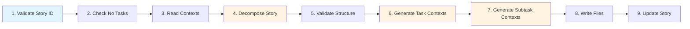

# Seed Ceremony

## Overview

The **Seed** ceremony decomposes a Story into Tasks (2-5) and Subtasks (1-3 per Task) for implementation. It creates atomic work units with complete context inheritance from Story, Epic, and Project levels.

**Purpose:** Transform a Story into implementable Tasks and Subtasks with full technical decomposition.

**Output:** Task and Subtask directories with doc.md, context.md, and work.json files.

**Duration:** 3-8 minutes per Story


## Prerequisites

Before running Seed:

1. **Project Expansion completed:**
   - Story exists in `.avc/project/context-XXXX-XXXX/`
   - Story work.json has `children: []` (no existing tasks)

2. **Story not already seeded:**
   - If `children` array is not empty → error: "Story already has tasks"

3. **LLM provider configured:**
   - API key in `.env` file (ANTHROPIC_API_KEY or GEMINI_API_KEY)
   - Provider set in `.avc/avc.json`


## How It Works - Workflow




## Processing Steps

### Step 1: Validate Story ID

Checks Story ID format and existence:
- **Format:** `context-XXXX-XXXX` (e.g., context-0001-0001)
- **Directory:** `.avc/project/context-XXXX-XXXX/` must exist
- **Files:** work.json and context.md must exist

**Error Handling:**
- Invalid format → Error: "Invalid Story ID format"
- Not found → Error: "Story not found. Please run /project-expansion first"

### Step 2: Check Story Has No Tasks

Validates that Story hasn't been seeded already:
- Reads `.avc/project/context-XXXX-XXXX/work.json`
- Checks `children` array is empty

**Error Handling:**
- If `children.length > 0` → Error: "Story already has tasks. Cannot re-seed."

### Step 3: Read Story/Epic/Project Contexts

Reads full context hierarchy for inheritance:

**Story Context:**
- `.avc/project/context-XXXX-XXXX/work.json` (Story metadata)
- `.avc/project/context-XXXX-XXXX/context.md` (Story context)

**Epic Context:**
- Extracts Epic ID from Story ID (context-0001-0001 → context-0001)
- `.avc/project/context-XXXX/context.md` (Epic context)
- `.avc/project/context-XXXX/work.json` (Epic metadata)

**Project Context:**
- `.avc/project/project/context.md` (Project context)

### Step 4: Decompose Story → Tasks + Subtasks

Uses `task-subtask-decomposer` agent to create implementation hierarchy:

**Input:**
- Story work.json (name, description, userType, acceptance criteria)
- Story context.md content
- Epic context.md content (for domain understanding)
- Project context.md content (for tech stack)

**Output:**
- JSON with 2-5 Tasks
- Each Task contains 1-3 Subtasks
- Task categories: backend, frontend, database, testing, infrastructure
- Subtasks are atomic (1-4 hours each)

**Agent Instruction:**
```
Story: User Registration (context-0001-0001)
Description: Enable new users to create accounts
Acceptance Criteria:
1. User can submit registration form
2. System validates email uniqueness
3. Confirmation email sent

Decompose into Tasks (2-5) and Subtasks (1-3 per Task).
Tasks should be technical components.
Subtasks should be atomic work units (1-4 hours).
```

### Step 5: Validate Task/Subtask Structure

Checks generated hierarchy meets requirements:
- **Task Count:** 2-5 Tasks per Story (warns if outside range)
- **Subtask Count:** 1-3 Subtasks per Task (warns if outside range)
- **Task ID Format:** `context-XXXX-XXXX-XXXX` (e.g., context-0001-0001-0001)
- **Subtask ID Format:** `context-XXXX-XXXX-XXXX-XXXX` (e.g., context-0001-0001-0001-0001)

**Error Handling:**
- Invalid ID format → Error: "Invalid Task/Subtask ID format"
- Out of range → Warning only (proceeds anyway)

### Step 6: Generate Task Contexts

For each Task, generates context.md using `feature-context-generator` agent:

**Input:**
- Project context.md
- Epic context.md
- Story context.md
- Task details (name, category, technicalScope, acceptance)

**Output:**
- Task context.md (~1200 tokens)
- Focus: Technical implementation details, API contracts, database schemas, Task-level patterns

**Inheritance:**
- Task contexts inherit from Story, Epic, and Project contexts
- Task contexts are passed down to Subtasks

### Step 7: Generate Subtask Contexts

For each Subtask, generates context.md using `feature-context-generator` agent:

**Input:**
- Project context.md
- Epic context.md
- Story context.md
- Task context.md (parent)
- Subtask details (name, description, technicalDetails, acceptance)

**Output:**
- Subtask context.md (~800 tokens)
- Focus: Atomic work unit details, specific implementation instructions, function signatures, test cases
- **Deepest context level** - directly used for implementation

**Inheritance:**
- Subtask contexts inherit from Task, Story, Epic, and Project contexts
- This is the final level - no further decomposition

### Step 8: Write Task/Subtask Files

Creates directory structure with 3 files per work item:

**Task Files:**
```
.avc/project/context-0001-0001-0001/
├── doc.md         # Stub (updated during retrospective)
├── context.md     # Task context (~1200 tokens)
└── work.json      # Task metadata
```

**Subtask Files:**
```
.avc/project/context-0001-0001-0001-0001/
├── doc.md         # Stub (updated during retrospective)
├── context.md     # Subtask context (~800 tokens)
└── work.json      # Subtask metadata with children: []
```

### Step 9: Update Story work.json

Updates parent Story to mark as seeded:
- Adds Task IDs to `children` array
- Sets `metadata.lastUpdated` timestamp
- Sets `metadata.seeded = true`


## AI Agents Used

The Seed ceremony uses **2 specialized AI agents**:

### 1. Task/Subtask Decomposer
- **File:** `agents/task-subtask-decomposer.md`
- **Purpose:** Decompose Story into technical Tasks and atomic Subtasks
- **Input:** Story context + Epic context + Project context + Story details
- **Output:** JSON with Task/Subtask hierarchy (2-5 Tasks, 1-3 Subtasks per Task)
- **Categories:** backend, frontend, database, testing, infrastructure
- **Validation:** Ensures atomic Subtasks (1-4 hours each)

### 2. Feature Context Generator
- **File:** `agents/feature-context-generator.md`
- **Purpose:** Generate context.md files for Tasks and Subtasks
- **Input (Task level):** Project + Epic + Story contexts + Task details
- **Output (Task level):** Task context.md (~1200 tokens)
- **Input (Subtask level):** Project + Epic + Story + Task contexts + Subtask details
- **Output (Subtask level):** Subtask context.md (~800 tokens)
- **Token Budgets:** Task ~1200, Subtask ~800


## Metadata Files (work.json)

### Task work.json Structure

```json
{
  "id": "context-0001-0001-0001",
  "name": "Task Name",
  "type": "task",
  "category": "backend",
  "description": "Task description",
  "technicalScope": "Express.js route, validation, error handling",
  "acceptance": ["criterion 1", "criterion 2"],
  "status": "planned",
  "dependencies": [],
  "children": ["context-0001-0001-0001-0001", "context-0001-0001-0001-0002"],
  "metadata": {
    "created": "2025-01-15T10:30:00.000Z",
    "ceremony": "seed",
    "tokenBudget": 1200
  }
}
```

### Subtask work.json Structure

```json
{
  "id": "context-0001-0001-0001-0001",
  "name": "Subtask Name",
  "type": "subtask",
  "description": "Atomic work unit description",
  "technicalDetails": "Specific implementation details",
  "acceptance": ["criterion 1", "criterion 2"],
  "status": "planned",
  "dependencies": [],
  "children": [],  // Subtasks have no children
  "metadata": {
    "created": "2025-01-15T10:30:00.000Z",
    "ceremony": "seed",
    "tokenBudget": 800
  }
}
```


## Usage

### Seed a Story

```bash
avc
> /seed context-0001-0001
```

**Example Output:**
```
🌱 Seed Ceremony

Story: context-0001-0001

📋 Reading Story context...

🔄 Stage 1/3: Decomposing Story into Tasks and Subtasks...

✅ Generated 3 Tasks with 7 Subtasks

📝 Stage 2/3: Generating context files...

   ✅ context-0001-0001-0001/doc.md
   ✅ context-0001-0001-0001/context.md
   ✅ context-0001-0001-0001/work.json
      ✅ context-0001-0001-0001-0001/doc.md
      ✅ context-0001-0001-0001-0001/context.md
      ✅ context-0001-0001-0001-0001/work.json
      ...

💾 Stage 3/3: Writing Task and Subtask files...

✅ Updated context-0001-0001/work.json

✅ Story decomposed into Tasks and Subtasks!

Story: User Registration (context-0001-0001)
  Created:
    • 3 Tasks
    • 7 Subtasks

Structure:
  Task: Registration API Endpoint (context-0001-0001-0001)
    • Subtask: Define registration interface
    • Subtask: Implement route handler
    • Subtask: Add unit tests
  Task: Validation Service (context-0001-0001-0002)
    • Subtask: Create validation schema
    • Subtask: Implement validation logic
  Task: Database Integration (context-0001-0001-0003)
    • Subtask: Create user model
    • Subtask: Write migration

📊 Token Usage:
   Input: 5,230 tokens
   Output: 3,840 tokens
   Total: 9,070 tokens
   API Calls: 10

✅ Token history updated

Next steps:
   1. Review Task/Subtask breakdown in .avc/project/
   2. Start implementing Subtasks (smallest work units)
```


## Task Categories

Tasks are organized into technical categories for clear separation of concerns:

### backend
- Server-side logic
- API endpoints
- Business logic
- Data processing

### frontend
- UI components
- Client-side logic
- User interactions
- Responsive design

### database
- Schema design
- Migrations
- Queries
- Indexes

### testing
- Unit tests
- Integration tests
- E2E tests
- Test fixtures

### infrastructure
- Deployment
- Configuration
- CI/CD
- Monitoring


## Error Handling

### Story Already Has Tasks

**Error:**
```
❌ Story context-0001-0001 already has tasks
   Children: context-0001-0001-0001, context-0001-0001-0002
   Cannot re-seed a Story that already has Tasks.
```

**Solution:** Story can only be seeded once. To modify, manually edit Task/Subtask structure or use Context Retrospective ceremony.

### Story Not Found

**Error:**
```
❌ Story context-0001-0001 not found
   Please run /project-expansion first to create Stories.
```

**Solution:** Run `/project-expansion` to create Stories first

### Invalid Story ID Format

**Error:**
```
❌ Invalid Story ID format: context-0001
   Expected format: context-XXXX-XXXX (e.g., context-0001-0001)
```

**Solution:** Use correct Story ID format with 4 digits per segment

### Missing Context Files

**Error:**
```
❌ Seed ceremony failed: Story context not found: context-0001-0001/context.md
```

**Solution:** Verify Story was created properly by Project Expansion ceremony

### LLM Provider Errors

**Error:**
```
⚠️  Retry 1/3 in 2s: Task/Subtask decomposition
   Error: rate limit exceeded
```

**Behavior:** Automatic retry with exponential backoff (3 attempts)


## Next Steps

After Seed completes:

1. **Review Task/Subtask Breakdown:**
   - Check `.avc/project/context-*-*-*/` directories
   - Read Task/Subtask context.md files
   - Validate technical scope and acceptance criteria

2. **Implement Subtasks:**
   - Subtasks are atomic work units (1-4 hours)
   - Implement one Subtask at a time
   - Update work.json status: planned → in-progress → completed

3. **Run Context Retrospective:**
   - After completing implementation
   - Update context.md files with learnings
   - Update doc.md files with actual implementation details


## Task/Subtask Decomposition Strategy

### How Tasks Are Created

Tasks represent **technical components** or **layers** of the system:

**Example Story:** "User Registration"

**Tasks:**
1. **Registration API Endpoint** (backend)
   - Express.js route handler
   - Input validation
   - Error handling

2. **Validation Service** (backend)
   - Email format validation
   - Uniqueness check
   - Business rules

3. **Database Integration** (database)
   - User model creation
   - Migration scripts
   - Indexes

4. **Registration UI** (frontend)
   - Registration form component
   - Client-side validation
   - Error display

5. **Email Service** (backend)
   - Confirmation email template
   - Email sending integration
   - Delivery tracking

### How Subtasks Are Created

Subtasks represent **atomic work units** that cannot be split further:

**Example Task:** "Registration API Endpoint"

**Subtasks:**
1. **Define registration interface** (~2 hours)
   - Create TypeScript interface
   - Document request/response
   - Add JSDoc comments

2. **Implement route handler** (~3 hours)
   - Create Express route
   - Implement registration logic
   - Add error handling

3. **Add unit tests** (~2 hours)
   - Test success case
   - Test validation errors
   - Test duplicate email

### Atomic Work Criteria

A Subtask is atomic if it:
- Can be implemented in **1-4 hours**
- Has **clear input/output**
- Is **unit-testable**
- Requires **single developer**
- Has **no dependencies** on other unfinished work


## Tips

- **One Story at a Time:** Seed Stories incrementally as you're ready to implement them
- **Review Before Implementing:** Check Task/Subtask breakdown makes technical sense
- **Start with Subtasks:** Implement atomic Subtasks rather than full Tasks
- **Update Status:** Mark Subtasks as in-progress/completed to track progress
- **Context Hierarchy:** Subtask contexts inherit from Task → Story → Epic → Project
- **Re-seeding:** Cannot re-seed a Story. Manually adjust if needed or use retrospective ceremony
