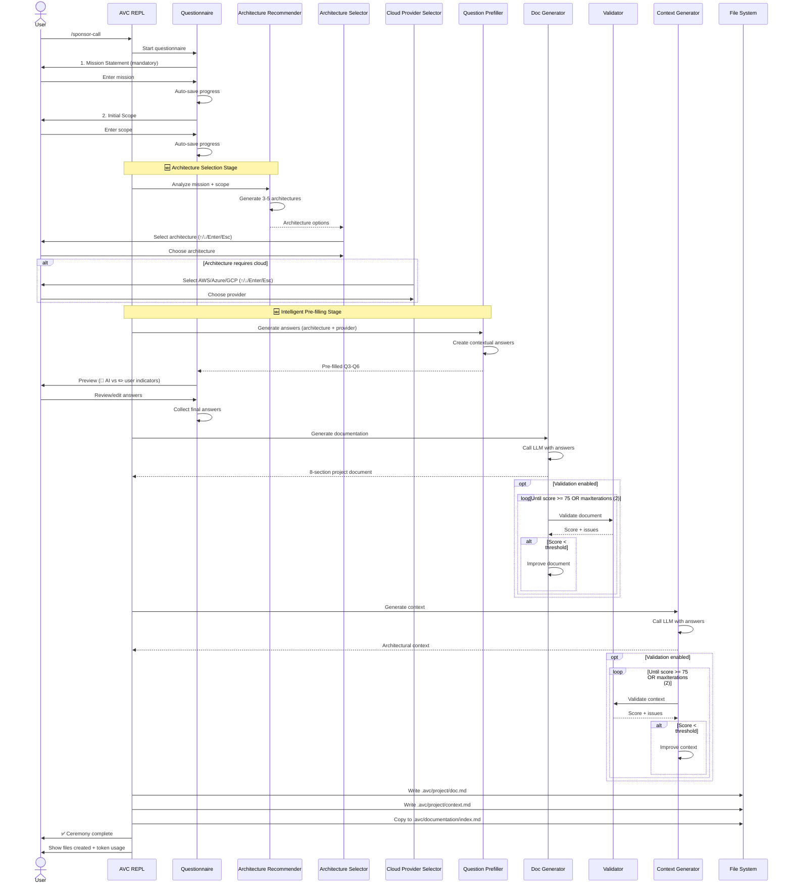

# Sponsor Call Ceremony

## Overview

The **Sponsor Call** ceremony is the foundational ceremony in the Agile Vibe Coding framework. It creates your project's brief and root context scope.

**Input**

Project team defined mission, scope and technical requirements.

**Output**

```
.avc/project/
├── doc.md              # project documentation
└── context.md          # root context scope
```

**Next Ceremony**

[`/sprint-planning`](sprint-planning.md) - Create Epics and Stories


## Ceremony Workflow

The Sponsor Call ceremony features an **architecture-aware workflow** that intelligently recommends deployment architectures and pre-fills technical questions based on your project requirements.



### Project Scope Gathering

The ceremony begins by asking the project team to define:

- The **mission statement**
- The **initial scope**
- Any additional **technical requirements** or **security constraints**


> **Only the Mission Statement is mandatory.**
> If any other question is skipped, AI agents will generate structured suggestions that can be reviewed and edited later.

#### Scope Questionnaire

| # | Question | Status | Purpose |
|---|----------|--------|---------|
| 1 | **Mission Statement** | Manual (required) | Defines the core purpose and value proposition of the project |
| 2 | **Initial Scope** | Manual or AI-suggested | Outlines key features, primary workflows, and essential capabilities |
| 3 | Target Users | 🤖 AI-prefilled (editable) | Identifies user types and their roles based on architecture |
| 4 | Deployment Target | 🤖 AI-prefilled (editable) | Specifies the intended deployment environment and infrastructure |
| 5 | Technical Considerations | 🤖 AI-prefilled (editable) | Captures technology stack preferences, constraints, or requirements |
| 6 | Security & Compliance Requirements | 🤖 AI-prefilled (editable) | Defines regulatory, privacy, and security obligations |

---

## Architecture Selection

After answering the Mission Statement and Initial Scope, the ceremony automatically triggers an intelligent architecture recommendation stage that reduces ceremony time by ~60%.

### How It Works

**1. AI Analysis**
   - Architecture Recommender agent analyzes your mission and scope
   - Uses Claude Opus 4.6 for exceptional architectural reasoning
   - Considers project complexity, features, scale, and requirements

**2. Architecture Options**
   - Presents 3-5 deployment architectures ranked by fit
   - Each option includes:
     - **Name:** Clear, concise architecture identifier (e.g., "Next.js Full-Stack on Vercel")
     - **Description:** Infrastructure approach and key services (2-3 sentences)
     - **Best For:** When this option is optimal for your use case
   - Visual indicators:
     - ☁️ = Requires cloud provider selection (AWS/Azure/GCP)
     - 🌐 = Platform-agnostic or PaaS

**3. Keyboard Navigation**
   - `↑/↓` arrows: Move between architecture options
   - `Enter`: Select architecture and proceed
   - `Esc`: Skip architecture selection (continue with manual questionnaire)

### Example Architecture Recommendations

For a task management application with team collaboration features:

```
🏗️  Recommended Deployment Architectures

Based on your mission and scope, here are 3 recommended approaches:

▶ ☁️ AWS Serverless Backend + React SPA
  Serverless API (Lambda + API Gateway) with React frontend on CloudFront.
  Scales automatically, pay-per-use pricing, minimal infrastructure management.
  Best for: Scalable multi-user applications with unpredictable traffic patterns

  🌐 Next.js Full-Stack on Vercel
  Next.js with Server Components and Vercel serverless functions.
  Zero-config deployment, excellent DX, built-in optimizations.
  Best for: Rapid development with modern framework and zero DevOps overhead

  🌐 Supabase Backend + React SPA
  JAMstack frontend with Supabase for database, auth, and realtime subscriptions.
  Managed Postgres, built-in auth, realtime features out-of-the-box.
  Best for: Fast iteration with managed backend services and realtime requirements

↑/↓: Navigate | Enter: Select | Esc: Skip (use manual answers)
```

### Cloud Provider Selection

If you select a cloud-based architecture (marked with ☁️), you'll be prompted to choose a cloud provider:

```
☁️  Select Cloud Provider for "AWS Serverless Backend + React SPA"

Your selected architecture requires a cloud provider. Choose one:

▶ 🟠 Amazon Web Services (AWS)
  Most comprehensive cloud platform with 200+ services and global reach.
  Services: Lambda, API Gateway, DynamoDB, S3, CloudFront, Cognito

  🔵 Microsoft Azure
  Strong .NET/Windows integration, excellent hybrid cloud capabilities.
  Services: Azure Functions, Cosmos DB, Azure CDN, Azure AD

  🔴 Google Cloud Platform (GCP)
  Cutting-edge data/ML services, strong Kubernetes and container support.
  Services: Cloud Functions, Firestore, Cloud CDN, Firebase Auth

↑/↓: Navigate | Enter: Select | Esc: Skip
```

**You can skip** cloud provider selection (`Esc`) to receive architecture-agnostic answers that don't reference specific cloud services.

### Question Pre-filling

After selecting architecture (and optionally cloud provider), the **Question Prefiller** agent generates contextual answers for the remaining questionnaire questions:

**Pre-filled Questions:**
1. **Target Users** - User personas, roles, and characteristics based on scope
2. **Deployment Target** - Specific hosting platform and infrastructure matching architecture
3. **Technical Considerations** - Tech stack, frameworks, scalability patterns aligned with architecture
4. **Security Requirements** - Auth, encryption, compliance inferred from architecture and scope

**Pre-filled answers are intelligent:**
- ✅ Align exactly with your selected architecture
- ✅ Include specific technologies and service names
- ✅ Reference your cloud provider if selected (e.g., "AWS Cognito for authentication")
- ✅ Infer requirements from scope (e.g., payments mentioned → PCI-DSS compliance)
- ✅ Match complexity to project maturity (MVP vs enterprise-scale)

**You can edit any answer** before proceeding to documentation generation.

### Enhanced Preview

The preview screen shows all collected answers with visual indicators:

```
📋 Review Your Answers

Review the collected information before generating documentation.
🤖 = AI-suggested (you can edit these)

✏️ 1. Mission Statement
A collaborative task management platform for remote teams to coordinate
work across time zones with real-time updates and async communication.

✏️ 2. Initial Scope
Task creation, assignment, status tracking, team workspaces, real-time
notifications, comment threads, file attachments.

🤖 3. Target Users (AI-suggested)
Remote team managers coordinating distributed teams (5-50 members), individual
contributors tracking personal and team tasks, project coordinators managing
cross-functional initiatives.

🤖 4. Deployment Target (AI-suggested)
AWS cloud using serverless stack: Lambda functions for API (Node.js), API
Gateway for routing, DynamoDB for data storage, S3 + CloudFront for frontend
hosting, Cognito for authentication. React SPA hosted on CloudFront CDN.

Actions:
  E: Edit an answer | S: Submit and continue | Esc: Cancel
```

All answers remain **fully editable**. The AI suggestions serve as intelligent defaults that you can refine to match your specific requirements.

### Tips for Architecture Selection

**When to use architecture selection:**
- ✅ You're unsure about deployment options for your project type
- ✅ You want expert guidance on modern architecture patterns
- ✅ You're prototyping and need a quick, informed start
- ✅ You want to learn recommended approaches for your use case
- ✅ You're exploring different deployment strategies

**When to skip (press `Esc`):**
- ⏭️ You have strong opinions about your architecture
- ⏭️ Your project has unique constraints not captured in recommendations
- ⏭️ You prefer to manually define all technical details
- ⏭️ Your organization has mandatory architecture standards

**Editing AI suggestions:**
- Always review AI-prefilled answers before final submission
- AI recommendations are starting points, not mandates
- Edit to match your specific requirements, constraints, and preferences
- Technical stack suggestions can be swapped for alternatives (e.g., PostgreSQL instead of DynamoDB)

---

### Ceremony Agents

#### Architecture Selection Agents

Intelligent agents that analyze your project and provide expert architecture recommendations.

| Agent | Purpose | Location |
|-------|---------|----------|
| [Architecture Recommender](/agents/architecture-recommender) | Analyzes mission and scope to recommend 3-5 deployment architectures (cloud, PaaS, non-web) | `/agents/architecture-recommender` |
| [Question Prefiller](/agents/question-prefiller) | Generates contextual answers for remaining questions based on selected architecture and cloud provider | `/agents/question-prefiller` |

#### Project Scope Agents

If a question is skipped (before architecture selection), specialized agents generate structured proposals.

| Agent | Purpose | Location |
|-------|---------|----------|
| [UX Researcher](/agents/suggestion-ux-researcher) | Generates target user suggestions | `/agents/suggestion-ux-researcher` |
| [Product Manager](/agents/suggestion-product-manager) | Proposes an initial feature scope | `/agents/suggestion-product-manager` |
| [Deployment Architect](/agents/suggestion-deployment-architect) | Suggests deployment environments and infrastructure | `/agents/suggestion-deployment-architect` |
| [Technical Architect](/agents/suggestion-technical-architect) | Recommends technology stack and architectural constraints | `/agents/suggestion-technical-architect` |
| [Security Specialist](/agents/suggestion-security-specialist) | Proposes security and compliance requirements | `/agents/suggestion-security-specialist` |

---

### Documentation & Context Generation

The collected answers are transformed into formal project artifacts using specialized AI agents.

#### Documentation Agents

| Agent | Purpose | Location |
|-------|---------|----------|
| [Documentation Creator](/agents/project-documentation-creator) | Converts questionnaire responses into a structured 8-section project document | `/agents/project-documentation-creator` |
| [Documentation Validator](/agents/validator-documentation) | Scores and validates documentation quality (0–100 scale) | `/agents/validator-documentation` |

#### Context Agents

| Agent | Purpose | Location |
|-------|---------|----------|
| [Context Generator](/agents/project-context-generator) | Generates architectural context from questionnaire inputs | `/agents/project-context-generator` |
| [Context Validator](/agents/validator-context) | Scores and validates context quality (0–100 scale) | `/agents/validator-context` |


## Next Steps

After completing the Sponsor Call:

### Review Generated Documents

**Project Documentation** (`.avc/project/doc.md`)

Comprehensive 8-section project document including:
- Executive Summary
- Problem Statement
- Solution Overview
- User Personas
- Core Features
- Technical Architecture
- Security Considerations
- Success Metrics

```bash
cat .avc/project/doc.md
```

> **Tip:** Run `/documentation` to view as a formatted website

**Project Context** (`.avc/project/context.md`)

Architectural context file that guides all future AI agents:

```bash
cat .avc/project/context.md
```

### Refine AI-Suggested Content

If you used architecture selection and question pre-filling:

1. **Review technical details** in `doc.md` for accuracy
2. **Verify cloud services** match your organization's approved list
3. **Check security requirements** align with your compliance needs
4. **Validate user personas** reflect your actual target audience

You can manually edit both files or re-run `/sponsor-call` with different selections.

### Proceed to Next Ceremony

**Sprint Planning** - Create Epics and Stories:
```bash
> /sprint-planning
```

See [Sprint Planning ceremony documentation](sprint-planning.md)

## Troubleshooting

View detailed ceremony logs:
```bash
cat .avc/logs/sponsor-call-*.log
```

Logs include:
- Full questionnaire responses
- LLM request/response details
- File write operations
- Error stack traces
