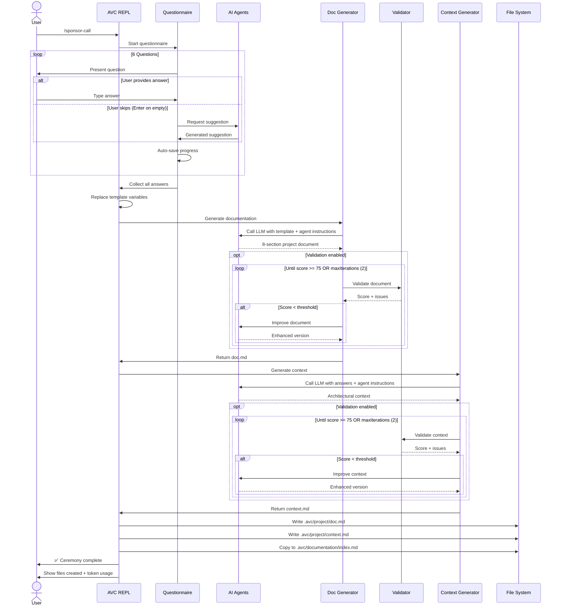

# Sponsor Call Ceremony

## Overview

The **Sponsor Call** ceremony is the foundational ceremony in the Agile Vibe Coding framework. It creates your project's brief and root context scope.

**Output**

```
.avc/project/
├── doc.md              # project documentation
└── context.md          # root context scope
```

**Next Ceremony**

[`/project-expansion`](project-expansion.md) - Create Epics and Stories


## Ceremony Workflow

The Sponsor Call ceremony follows a  workflow that transforms user initial requirements into comprehensive project documentation (project brief) and a root context scope.



### User Requirements

The ceremony starts by running /sponsor-call command, asking the user to define the project mission statement, the initial scope and any extra technical requirement or security concerns.

> **Only the mission statement is mandatory**, and AI agents will fill the gap for any skipped questions.

| # | Question | Purpose |
|---|----------|---------|
| 1 | **Mission Statement** | Core purpose and value proposition |
| 2 | Target Users | User types and their roles |
| 3 | Initial Scope | Key features, main workflows, essential capabilities |
| 4 | Deployment Target | Target deployment environment and infrastructure |
| 5 | Technical Considerations | Technology stack, constraints, or preferences |
| 6 | Security & Compliance Requirements | Regulatory, privacy, or security constraints |

#### User Requirements Agents

When user skips a question, we use agents to fill the gaps, which later can be edited.

| Agent | Purpose |
|-------|---------|
| [UX Researcher](/agents/suggestion-ux-researcher) | Generate target user suggestions when skipped |
| [Product Manager](/agents/suggestion-product-manager) | Generate initial scope suggestions when skipped |
| [Deployment Architect](/agents/suggestion-deployment-architect) | Generate deployment target suggestions when skipped |
| [Technical Architect](/agents/suggestion-technical-architect) | Generate technical considerations when skipped |
| [Security Specialist](/agents/suggestion-security-specialist) | Generate security & compliance suggestions when skipped |

The collected answers are then used to generate professional project documentation and architectural context through specialized AI agents. 

| Stage | Agent | Purpose |
|-------|-------|---------|
| Documentation | [Documentation Creator](/agents/project-documentation-creator) | Transform questionnaire answers into 8-section project document |
| Documentation | [Documentation Validator](/agents/validator-documentation) | Score and validate documentation quality (0-100 scale) |
| Context | [Context Generator](/agents/project-context-generator) | Generate architectural context from questionnaire answers |
| Context | [Context Validator](/agents/validator-context) | Score and validate context quality (0-100 scale) |

If validation is enabled, validator agents score the outputs and trigger iterative improvements until quality thresholds are met. Finally, the ceremony writes the generated files and syncs documentation to VitePress for immediate viewing. The entire process is orchestrated with progress tracking, auto-save functionality, and optional quality validation loops.


## Next Steps

After completing the Sponsor Call:

### Review Generated Documents

**Project Documentation**

```bash
cat .avc/project/doc.md
```

> Run ```/documentation``` to view 

**Project Context**

```bash
cat .avc/project/context.md
```

### Proceed to Next Ceremony

**Project Expansion** - Create Epics and Stories:
```bash
> /project-expansion
```

See [Project Expansion ceremony documentation](project-expansion.md)

## Troubleshooting

View detailed ceremony logs:
```bash
cat .avc/logs/sponsor-call-*.log
```

Logs include:
- Full questionnaire responses
- LLM request/response details
- File write operations
- Error stack traces
