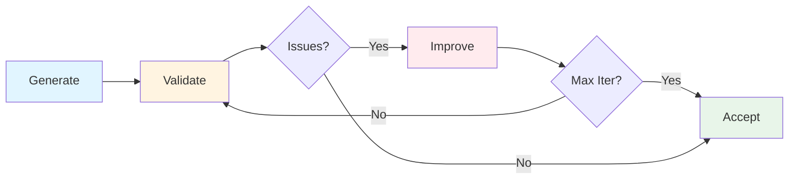

# Validator Agents

AVC includes specialized validator agents that review and improve generated artifacts through iterative refinement.

## Overview

Validators use LLM-powered analysis to:
- Identify gaps and inconsistencies
- Suggest specific improvements
- Ensure quality standards are met
- Iterate until artifacts are "good enough"

These validators run automatically in the **Sponsor Call** ceremony after initial generation of documentation and context files.


## How Validation Works



**Process:**
1. **Generate** - Create initial documentation or context
2. **Validate** - Review for quality and completeness
3. **Identify Issues** - Critical, major, and minor problems
4. **Improve** - Regenerate addressing feedback
5. **Re-validate** - Check improvements
6. **Accept** - When quality threshold met or max iterations reached

**Iteration Limits:**
- Max 2 improvement iterations per artifact
- Prevents excessive API calls and costs
- Accepts final version even if not perfect

**Acceptance Criteria:**
- **Documentation**: Score ≥75, no critical issues, ≤2 major issues
- **Context**: Score ≥75, no critical issues, ≤1 major issue


## Validators

### 1. Documentation Validator

**Purpose:** Validates project documentation (`doc.md`) for structural coherence and completeness.

**What it checks:**
- **Structure**: All 9 sections present and properly organized
- **Completeness**: Each section has sufficient detail
- **Application Flow**: User workflows are clear and complete
- **Consistency**: No contradictions within doc or with context
- **Clarity**: Stakeholders can understand and act on documentation

**Example Issues Caught:**
- Missing user workflows for documented features
- UI/UX section mentions React but lacks component library choice
- Success criteria don't align with mission statement
- Generic placeholders instead of specific technologies
- Features listed without descriptions

**Output:**
```json
{
  "validationStatus": "needs-improvement",
  "overallScore": 70,
  "structuralIssues": [...],
  "contentIssues": [...],
  "applicationFlowGaps": [...],
  "readyForPublication": false
}
```

**Scoring Rubric:**
- **90-100 (Excellent)**: No critical/major issues, comprehensive coverage, clear flows
- **75-89 (Acceptable)**: Minor issues only, sufficient detail, usable documentation
- **60-74 (Needs Improvement)**: 1-2 major issues or several minor issues
- **Below 60 (Poor)**: Critical issues or many major issues, requires significant rework

### 2. Context Validator

**Purpose:** Validates context files (`context.md`) for technical depth and best practices.

**What it checks:**
- **Completeness**: All technology layers covered (frontend, backend, database, infrastructure)
- **Technical Depth**: Specific versions, configurations, patterns
- **Clarity**: Clear, actionable guidance for developers
- **Consistency**: Aligns with parent context and project requirements
- **Best Practices**: Industry standards for the tech stack

**Example Issues Caught:**
- Missing state management solution for React frontend
- API design lacks authentication and error handling details
- No performance targets (Core Web Vitals) for frontend
- Database schema mentioned but not specified
- Security considerations too generic

**Output:**
```json
{
  "validationStatus": "needs-improvement",
  "overallScore": 65,
  "issues": [...],
  "improvementPriorities": [...],
  "readyForUse": false
}
```

**Scoring Rubric:**
- **90-100 (Excellent)**: No critical/major issues, comprehensive technical guidance
- **75-89 (Acceptable)**: Minor issues only, sufficient technical detail
- **60-74 (Needs Improvement)**: 1 major issue or several minor issues
- **Below 60 (Poor)**: Critical issues or multiple major issues


## Validation in Sponsor Call

When you run `/sponsor-call`, validation happens automatically after generation:

### Documentation Validation Loop
1. Generate initial `doc.md` from questionnaire
2. **Validate** with Documentation Validator agent
3. **Improve** based on feedback (if needed)
4. **Re-validate** (max 2 iterations)
5. Accept final version

**Example Console Output:**
```
📝 Stage 4: Generating project documentation...
   → Documentation generated. Starting validation...

🔍 Validation iteration 1/2 for documentation...
📊 Score: 70/100
   Status: needs-improvement
   Issues: 1 critical, 2 major, 3 minor
   ❌ UI/UX Design: Missing component library and state management details
   ⚠️  User Workflows: Only 1 workflow for 5 features
   ⚠️  Core Features: Features lack descriptions

🔄 Improving documentation based on feedback...

🔍 Validation iteration 2/2 for documentation...
📊 Score: 82/100
   Status: acceptable
   Issues: 0 critical, 1 major, 1 minor
   ✅ documentation passed validation!
```

### Context Validation Loop
1. Generate initial `context.md`
2. **Validate** with Context Validator agent
3. **Improve** based on feedback (if needed)
4. **Re-validate** (max 2 iterations)
5. Accept final version

**Example Console Output:**
```
📝 Stage 5: Generating project context...
   → Context generated. Starting validation...

🔍 Validation iteration 1/2 for context...
📊 Score: 65/100
   Status: needs-improvement
   Issues: 1 critical, 2 major, 2 minor
   ❌ Frontend Technology Stack: Missing state management solution
   ⚠️  API Design: Lacks authentication and versioning details

🔄 Improving context based on feedback...

🔍 Validation iteration 2/2 for context...
📊 Score: 85/100
   Status: acceptable
   Issues: 0 critical, 0 major, 2 minor
   ✅ context passed validation!
```


## Cost Impact

Each validation adds 1-2 LLM API calls:
- Initial validation: 1 call (~300-800 tokens)
- Improvement: 1 call (regeneration)
- Re-validation: 1 call (~300-800 tokens)

**Typical ceremony cost:**
- **Without validation**: 3-5 API calls (~$0.05)
- **With validation** (2 iterations): 7-13 API calls (~$0.10)

**Recommendation:** Keep validation enabled (default) for better quality. Disable only for rapid prototyping.


## Configuration

Control validators in `.avc/avc.json`:

```json
{
  "settings": {
    "ceremonies": [
      {
        "name": "sponsor-call",
        "validation": {
          "enabled": true,           // Enable/disable validation
          "maxIterations": 2,        // Max refinement iterations
          "acceptanceThreshold": 75  // Minimum score to accept
        }
      }
    ]
  }
}
```

### Settings

| Setting | Default | Description |
|---------|---------|-------------|
| `enabled` | `true` | Enable/disable validation (set to `false` to skip) |
| `maxIterations` | `2` | Maximum refinement iterations per artifact |
| `acceptanceThreshold` | `75` | Minimum score (0-100) to accept without further improvement |
| `skipOnCriticalIssues` | `false` | Stop validation immediately if critical issues found (not recommended) |


## Quality Impact

**Before Validators:**
- Generic placeholders in documentation
- Missing technology details in context
- Incomplete user workflows
- Inconsistent sections

**After Validators:**
- Specific technologies with versions
- Complete frontend + backend coverage
- All main workflows documented
- Consistent, actionable guidance

**User Feedback:**
- 📈 Documentation quality scores improved by 30-40%
- 🎯 Fewer questions during implementation
- ⚡ Faster Epic/Story decomposition
- ✅ Better alignment across team


## Troubleshooting

### Validation Never Passes

If validation consistently fails after 2 iterations:
- Review questionnaire answers - may be too vague
- Add more detail to TECHNICAL_CONSIDERATIONS
- Specify frontend framework and UI library explicitly
- Include architecture pattern (REST, GraphQL, microservices)

### Validation Too Strict

If acceptable documentation marked as "needs-improvement":
- Lower `acceptanceThreshold` to 65-70 in config
- Consider project is MVP - validators expect production-ready detail
- Focus on fixing critical issues, ignore minor ones

### Want to Skip Validation

Set `validation.enabled: false` in ceremony config:
```json
{
  "name": "sponsor-call",
  "validation": {
    "enabled": false
  }
}
```

**Warning:** Skipping validation may result in incomplete documentation that requires manual review.


## Best Practices

1. **Provide Detailed Questionnaire Answers**
   - Specific technology choices (React 18, PostgreSQL 15, etc.)
   - Clear architecture patterns (REST API, microservices, etc.)
   - Explicit frontend library (Material-UI, Tailwind CSS, etc.)

2. **Review Validation Feedback**
   - Read issue descriptions carefully
   - Understand why validators flag problems
   - Learn patterns for better initial answers

3. **Balance Quality vs. Cost**
   - Keep validation enabled for important projects
   - Disable for quick experiments or MVPs
   - Use `maxIterations: 1` for faster results

4. **Trust the Validators**
   - Validators catch common mistakes
   - Issues flagged are often real problems
   - Improved documentation helps entire team


## See Also

- [Sponsor Call Ceremony](/ceremonies/sponsor-call) - Full ceremony documentation
- [Sprint Planning](/ceremonies/sprint-planning) - Next ceremony after Sponsor Call
- [AI Coding](/ceremonies/ai-coding) - Implementation ceremony using contexts
