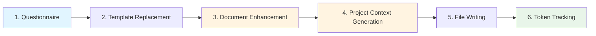

# Sponsor Call Ceremony

## Overview

The **Sponsor Call** ceremony is the first ceremony in the Agile Vibe Coding framework. It creates the project foundation by capturing project vision, scope, and requirements through an interactive questionnaire, then generating comprehensive project documentation and architectural context.

**Purpose:** Establish project foundation with documentation and architectural context that guides all subsequent work.

**Output:** Project documentation (doc.md) and project-level architectural context (context.md).

**Duration:** 10-20 minutes

---

## Interactive Questionnaire

The ceremony collects project information through **5 core questions**:

1. **Mission Statement** - Core purpose and value proposition (text)
2. **Target Users** - User types and roles (list)
3. **Initial Scope** - Key features and workflows (text)
4. **Technical Considerations** - Tech stack, constraints, preferences (text)
5. **Security & Compliance** - Security, privacy, regulatory requirements (text)

### AI-Powered Suggestion System

When you skip a question, AVC uses **domain-specific AI agents** to generate contextual suggestions:

| Question | Agent | Expertise |
|----------|-------|-----------|
| Mission Statement | Business Analyst | Defining clear, compelling mission statements |
| Target Users | UX Researcher | Identifying user personas and roles |
| Initial Scope | Product Manager | Defining features and prioritizing scope |
| Technical Considerations | Technical Architect | Technology stack, architecture patterns, scalability |
| Security & Compliance | Security Specialist | Security, privacy, compliance regulations |

Each agent has specialized knowledge of its domain and generates responses formatted according to industry best practices.

**Fallback Strategy:**
1. **AI Generation with Specialized Agent** - Domain expert generates contextual suggestion using previous answers
2. **Guidelines** (if configured) - Use pre-configured defaults from `.avc/avc.json`
3. **Empty Value** - Question left unanswered, will be handled in later refinement

---

## How It Works - Workflow



**Next Ceremony:** After Sponsor Call completes, run `/project-expansion` to create Epics and Stories.

### Step 1: Questionnaire

Collect project information through interactive prompts with AI-powered suggestions.

**Process:**
1. Read template and extract 5 variables
2. Present each question to user with guidance
3. User can type answer or press Enter to skip
4. For skipped questions, invoke domain-specific AI agent:
   - Business Analyst for Mission Statement
   - UX Researcher for Target Users (2-4 personas)
   - Product Manager for Initial Scope (5-8 features)
   - Technical Architect for Technology stack
   - Security Specialist for Security requirements
5. Auto-save progress every 30 seconds

### Step 2: Template Replacement

Fill project template with collected answers.

**Process:**
1. Replace all `{{VARIABLE}}` placeholders with answers
2. Handle plural variables (arrays) as bulleted lists
3. Create formatted markdown document

### Step 3: Document Enhancement

Transform filled template into professional 8-section document.

**Agent:** Documentation Specialist (`agents/documentation.md`)

**Process:**
1. Load Documentation Specialist agent instructions
2. Send filled template to LLM with agent as system prompt
3. Receive enhanced markdown document with 8 sections:
   - Application Overview
   - Target Users and Stakeholders
   - Key Features and Functionality
   - User Workflows
   - Technical Architecture
   - Integration Requirements
   - Security and Compliance
   - Success Criteria

**Output:** `.avc/project/project/doc.md`

### Step 4: Hierarchy Generation

Decompose features into Epics and Stories.

**Agent:** Software Architect (`agents/decomposition.md`)

**Process:**
1. Load Software Architect agent instructions
2. Build decomposition prompt with all questionnaire answers
3. Request JSON output with strict schema
4. Validate response (3-7 Epics, 10-30 Stories)
5. Store hierarchy in memory for next step

**Output Format:**
```json
{
  "epics": [
    {
      "id": "epic-001",
      "name": "Epic Name",
      "description": "...",
      "stories": [
        {
          "id": "story-001-001",
          "name": "Story Name",
          "description": "...",
          "acceptanceCriteria": ["..."]
        }
      ]
    }
  ]
}
```

### Step 5: Context Generation

Generate context.md files for each hierarchy level.

**Agent:** Context Generator (`agents/context-generator.md`)

**Process:**
1. Load Context Generator agent instructions
2. Generate project context
3. For each Epic: Generate epic context
4. For each Story: Generate story context
5. Each context includes:
   - Scope summary
   - Token budget validation
   - Context inheritance from parent levels

### Step 6: File Writing

Write all generated files to `.avc/project/` directory.

**Process:**
1. Write project files:
   - `project/doc.md` - Enhanced 8-section document
   - `project/context.md` - Project-level context
2. For each Epic:
   - `{epic-id}/doc.md` - Initial placeholder
   - `{epic-id}/context.md` - Epic context
3. For each Story:
   - `{epic-id}/{story-id}/doc.md` - Story description + acceptance criteria
   - `{epic-id}/{story-id}/context.md` - Story context

### Step 7: Token Tracking

Save token usage statistics to `.avc/token-history.json`.

**Process:**
1. Collect token usage from all API calls
2. Display statistics (input/output/total/calls)
3. Update token history with aggregations:
   - Global totals (daily, weekly, monthly, allTime)
   - Per-ceremony totals (sponsor-call: daily, weekly, monthly, allTime)
4. Enable tracking via `/tokens` command

---

## AI Agents Used

The Sponsor Call ceremony uses **7 specialized AI agents** (2 ceremony agents + 5 optional suggestion agents):

### Domain-Specific Suggestion Agents (Optional - Step 1)

These agents are invoked **only when the user skips a questionnaire question**. They provide AI-generated suggestions based on context from previous answers.

#### 1. Business Analyst
- **File:** `agents/suggestion-business-analyst.md` → [View Full Agent Documentation](/agents/suggestion-business-analyst)
- **Purpose:** Generate mission statements
- **Output:** 50-100 word mission following "Enable/Empower/Provide" pattern
- **Focus:** Value proposition, target users, core purpose

#### 2. UX Researcher
- **File:** `agents/suggestion-ux-researcher.md` → [View Full Agent Documentation](/agents/suggestion-ux-researcher)
- **Purpose:** Identify user personas
- **Output:** 2-4 distinct user types with role descriptions
- **Considerations:** Domain context (B2B, B2C, Healthcare), permission levels

#### 3. Product Manager
- **File:** `agents/suggestion-product-manager.md` → [View Full Agent Documentation](/agents/suggestion-product-manager)
- **Purpose:** Define feature scope
- **Output:** 5-8 high-level features prioritized by importance
- **Categories:** Core (must-have), Secondary, Enhancement

#### 4. Technical Architect
- **File:** `agents/suggestion-technical-architect.md` → [View Full Agent Documentation](/agents/suggestion-technical-architect)
- **Purpose:** Recommend technology stack and architecture
- **Output:** 100-200 words covering stack, architecture, scalability, constraints
- **Patterns:** Monolith, Microservices, Serverless

#### 5. Security Specialist
- **File:** `agents/suggestion-security-specialist.md` → [View Full Agent Documentation](/agents/suggestion-security-specialist)
- **Purpose:** Define security and compliance requirements
- **Output:** 150-250 words covering auth, data protection, compliance, monitoring
- **Regulations:** HIPAA, GDPR, PCI-DSS, SOC2

### Core Ceremony Agents (Steps 3-4)

These agents run automatically during the ceremony to create project foundation.

#### 6. Project Documentation Creator
- **File:** `agents/project-documentation-creator.md` → [View Full Agent Documentation](/agents/project-documentation-creator)
- **Purpose:** Transform questionnaire responses into professional project document
- **Input:** 5 questionnaire variables (filled template)
- **Output:** `.avc/project/project/doc.md` - 8-section markdown document
- **Token Budget:** ~3000-5000 tokens
- **Sections:** Overview, Target Users, Initial Scope, Technical Considerations, Security/Compliance, Workflows, Integrations, Success Criteria

#### 7. Project Context Generator
- **File:** `agents/project-context-generator.md` → [View Full Agent Documentation](/agents/project-context-generator)
- **Purpose:** Generate project-level architectural context
- **Input:** 5 questionnaire variables
- **Output:** `.avc/project/project/context.md` - Project context (~500 tokens)
- **Token Budget:** ~500 tokens
- **Focus:** Technology stack, cross-cutting concerns, architecture principles, development standards
- **Inheritance:** This context is inherited by all Epic/Story/Task/Subtask contexts

### Agents Moved to Other Ceremonies

The following agents are **no longer used** in Sponsor Call (moved to other ceremonies):

- **Epic/Story Decomposer** → Moved to `/project-expansion` ceremony
- **Feature Context Generator** → Moved to `/project-expansion` and `/seed` ceremonies

---

## Ceremony Output

### File Structure

```
.avc/project/
└── project/
    ├── doc.md              # Enhanced 8-section project document (~4KB)
    └── context.md          # Project-level architectural context (~500 tokens)
```

### Output Summary

**1. Project Documentation (doc.md)** - Comprehensive 8-section project definition:
  - **Application Overview** - Mission, purpose, key objectives
  - **Target Users and Stakeholders** - User personas, roles, stakeholders
  - **Initial Scope** - Features and functional areas to implement
  - **Technical Considerations** - Technology stack, architecture, constraints
  - **Security and Compliance** - Security requirements, regulations, privacy
  - **User Workflows** - Primary user journeys and interactions
  - **Integration Requirements** - External systems, APIs, dependencies
  - **Success Criteria** - Metrics, KPIs, definition of done

**2. Project Context (context.md)** - Architectural foundation (~500 tokens):
  - Technology stack and frameworks
  - Cross-cutting concerns (auth, logging, error handling)
  - Architecture principles and patterns
  - Development standards and conventions
  - This context is inherited by all Epic/Story/Task/Subtask contexts

### What's NOT Created (Moved to Project Expansion)

The following are now created by the `/project-expansion` ceremony:
- ~~Epic directories~~ - Created by Project Expansion
- ~~Story directories~~ - Created by Project Expansion
- ~~Epic/Story work.json files~~ - Created by Project Expansion
- ~~Epic/Story context.md files~~ - Created by Project Expansion

---

## Configuration

### LLM Provider Configuration

**File:** `.avc/avc.json`

```json
{
  "version": "0.1.0",
  "settings": {
    "ceremonies": [
      {
        "name": "sponsor-call",
        "provider": "claude",
        "defaultModel": "claude-sonnet-4-5-20250929"
      }
    ]
  }
}
```

**Supported Providers:**
- **Claude** - Anthropic API (claude-sonnet-4-5, claude-opus-4-5)
- **Gemini** - Google Generative AI (gemini-2.5-flash, gemini-2.5-pro)

### Guidelines Configuration

Pre-configure default values for questionnaire questions:

```json
{
  "settings": {
    "guidelines": {
      "missionstatement": "Default mission for all projects",
      "targetusers": "Default user types",
      "initialscope": "Default feature set",
      "technicalconsiderations": "Default tech stack",
      "securityandcompliancerequirements": "Default security requirements"
    }
  }
}
```

---

## Running the Ceremony

### Prerequisites

1. Project initialized with `/init`
2. API key configured in `.env`:
   - `ANTHROPIC_API_KEY` for Claude
   - `GEMINI_API_KEY` for Gemini

### Execution

```bash
avc
> /sponsor-call
# or use alias:
> /sc
```

### Interactive Flow

1. **Questionnaire** - Answer 5 questions (or press Enter to skip)
2. **Preview** - Review all answers before submission
3. **Processing** - Watch 7-stage progress:
   - Stage 1/7: Questionnaire (interactive)
   - Stage 2/7: Template replacement
   - Stage 3/7: Document enhancement
   - Stage 4/7: Hierarchy generation
   - Stage 5/7: Context generation (29 sub-steps)
   - Stage 6/7: File writing
   - Stage 7/7: Token tracking
4. **Completion** - Review generated files in `.avc/project/`

### Progress & Resume

- **Auto-save:** Every 30 seconds during questionnaire
- **Resume:** If interrupted, next `/sponsor-call` offers to resume
- **Progress file:** `.avc/sponsor-call-progress.json`

---

## Next Steps

After completing the Sponsor Call:

1. **Review Generated Documents**
   - `.avc/project/project/doc.md` - Main project definition
   - Epic and Story files for completeness

2. **Refine Hierarchy** (optional)
   - Add/remove/modify Epics and Stories as needed
   - Update context files for clarity

3. **View Token Usage**
   ```bash
   > /tokens
   ```

4. **Proceed to Next Ceremony**
   - **Project Expansion** - Decompose Stories into Tasks
   - **AI Coding** - Implement individual tasks
   - **Context Retrospective** - Update contexts based on learnings

---

## Troubleshooting

### Common Issues

**Issue:** "API key not set"
- **Solution:** Add `ANTHROPIC_API_KEY` or `GEMINI_API_KEY` to `.env` file

**Issue:** "Rate limit exceeded"
- **Solution:** Wait a moment and retry. AVC includes automatic retry with exponential backoff.

**Issue:** "Invalid JSON response from hierarchy generation"
- **Solution:** This is rare. Retry the ceremony. If persistent, check API provider status.

**Issue:** "Context generation taking too long"
- **Solution:** Normal for large projects (23+ stories). Each context is generated sequentially. Consider reducing story count or using faster model (gemini-2.5-flash).

### Debug Mode

View detailed logs:
```bash
.avc/logs/sponsor-call-{timestamp}.log
```

---

## Technical Implementation

For developers interested in the implementation details, see:

- **Code:** `src/cli/template-processor.js` - Main ceremony logic
- **Template:** `src/cli/templates/project.md` - Questionnaire template
- **Agents:** `src/cli/agents/` - All AI agent instructions
- **Tests:** `src/tests/unit/questionnaire.test.js` - Questionnaire tests

**Key Methods:**
- `processTemplate()` - Main workflow orchestrator
- `generateSuggestions()` - Domain agent selection and invocation
- `generateFinalDocument()` - Document enhancement
- `generateHierarchy()` - Epic/Story decomposition
- `generateContext()` - Context file generation
