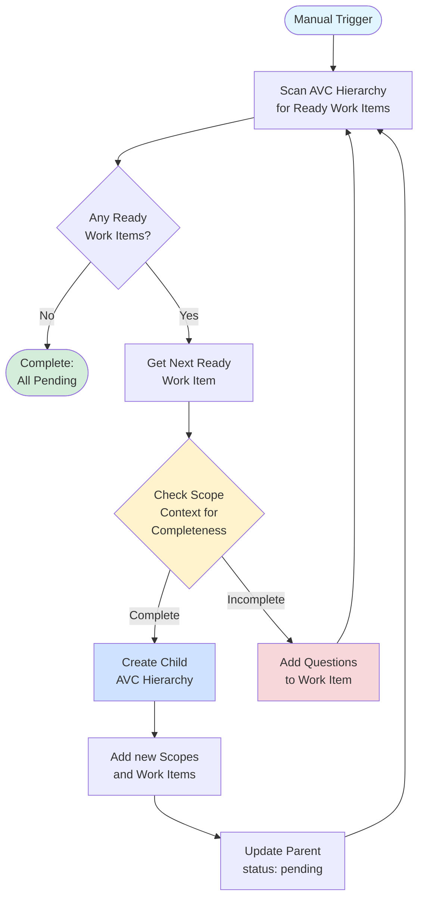

# Agile Vibe Coding (AVC)

**A framework for managing agent-based software development projects**

| | |
|---|---|
| **Version** | DRAFT |
| **License** | [MIT](https://github.com/NachoColl/agilevibecoding/blob/master/LICENSE) |
| **Authors** | @NachoColl ([How to Contribute](https://github.com/NachoColl/agilevibecoding/blob/master/CONTRIBUTING.md)) |
| **Website** | [agilevibecoding.org](https://agilevibecoding.org) |


Agile Vibe Coding (AVC) is a structured approach to consistent long-term software development with AI agents. The framework breaks down large projects into verifiable, trackable features that specialized agents can implement in parallel without conflicts, while continuously improving context quality through systematic measurement and retrospective analysis. 


## The Challenge

Large software projects stress LLM-based coding agents in ways that differ fundamentally from how human development teams operate. Unlike humans, which retain long-term memory and build overall abstract understanding through iteration, LLMs do not have these capacities. 

- LLMs are probabilistic and sensitive to prompt formulation (non-deterministic).
- LLM's context should not be understood as a memory but as information.
- When context exceeds a model's effective range, coherence degrades.
- The linear predictive nature of LLMs enforces sequential reasoning, limiting native parallel deliberation.

Left unguided, AI coding agents drift. Context decays. Abstractions fracture. Logic duplicates. Regressions surface across independently generated features. These are not defects of the models, but natural consequences of bounded context, ephemeral reasoning, and probabilistic generation operating without the persistent internal understanding that humans develop over time.

Can we still build large, complex systems with LLMs despite these constraints? Yes. By shaping context, constraints, and verification through deliberate frameworks and disciplined practice, we guide LLMs toward coherent outcomes. Where models lack persistent understanding, we supply externalized knowledge through a framework: where reasoning is ephemeral, we anchor it in artifacts. 

Let's call it the Agile Vibe Coding framework.

## The Agile Vibe Coding framework

AVC provides a **hierarchy of assets**, **specialized agents**, and **workflows** for handling the common challenges of sustained software delivery using LLMs.

### AVC assets hierarchy

**Agile Vibe Coding** adopts the Agile project management items hierarchy (Epic -> Story -> Task -> Subtask) adding context boundaries.

```
project/
├── context.md                                # project-wide context
└── epic-0001/
    ├── context.md                            # epic-level context (domain/area)
    └── story-0001-0001/
        ├── context.md                        # story-level context (user capability)
        ├── story.json                        # story definition
        └── task-0001-0001-0001/
            ├── context.md                    # task-level context (implementation unit)
            ├── task.json                     # task definition
            ├── subtask-0001-0001-0001-0001/
            │   ├── context.md                # subtask-level context (atomic work)
            │   └── subtask.json              # subtask definition
            └── subtask-0001-0001-0001-0002/
                ├── context.md
                └── subtask.json
```

| Asset | Content |
|-------|-------------|
| **Project** | A project contains work items grouped in context scopes. |
| **Context Scope** | A context scope contains work items and the *minimal* set of information required for LLMs to *properly handle* the work. |
| **Work Item** | Work items are JSON files containing at least a single **work prompt**, multiple **validation prompts** and a status. |

```json
{
  "id": "subtask-0001-0001-0001-0001",
  "name": "Create JWT Payload Interface",
  "scope": "epic-0001/story-0001-0001/task-0001-0001-0001",
  "status": "pending",
  "dependencies": [],
  "prompt": "Create TypeScript interface for JWT payload in src/types/JWTPayload.ts. Include properties: userId (string), email (string), role ('user' | 'admin' literal type), exp (number), iat (number). Add JSDoc comments. Export as named interface.",
  "implementation": {
    "status": "pending",
    "files": ["src/types/JWTPayload.ts"],
    "completedAt": null,
    "gitCommit": null
  },
  "validation": {
    "status": "pending",
    "tests": [{
      "status": "pending",
      "testPrompt": "Verify JWTPayload interface is properly exported with all required properties and correct types.",
      "validations": [{
        "criteria": "Interface exported from src/types/JWTPayload.ts",
        "status": "pending"
      }, {
        "criteria": "All 5 properties exist with correct types",
        "status": "pending"
      }, {
        "criteria": "TypeScript compiles without errors",
        "status": "pending"
      }]
    }],
    "allTestsPassed": false
  },
  "completedAt": null
}
```
*Work item definition*

### AVC Ceremonies

As with Agile project management, the Agile Vibe Coding framework contains a set of ceremonies and processes to manage the project moving forward.

#### **Project Expansion**

A project expansion ceremony is manually triggered and checks the AVC hierarchy for work items in *ready* status. For each ready work item, it checks the scope context for completeness. If no extra information is required, it creates a child AVC hierarchy with a new set of context scopes and work items with the ready status, and updates the parent work item status to *pending*. If extra information is required, it updates the work item and adds a list of questions that need to be resolved before continuing and sets the status to *feedback*.


<!-- diagram id="project-expansion" caption: "Project Expansion Ceremony Flow" -->

This ceremony continues recursively until all work items are in pending status.

##### Ceremony stakeholders (Humans and Specialized Agents)

The project expansion ceremony requires the following stakeholders.

| stakeholder | type | reponsabilities 
|-------|-------------|-------|
| product owner | human | Check initial scope assets and triger the ceremony (handled by the agent).
| product owner | agent | 
| 
| devs | human | Responsible for bringing scope accuracy when product owner


#### **Context Retrospective** 

A context retrospective updates all context scopes.

### AVC Specialized agents

AVC uses the following specialized agents:


**Product Owner Agent**


Sets up tracking infrastructure.

**Prompt:** See `prompts/initializer.md`

**Output:**
- Verifies/creates feature files
- Creates `claude-progress.txt`
- Creates `init.sh`
- Creates baseline git commit


#### Controller Agent

Orchestrates feature implementation.

**Prompt:** See `prompts/controller.md`

**Workflow:**
1. Read `claude-progress.txt` (resume state)
2. Review git log (understand recent work)
3. Run baseline tests (verify health)
4. Select next feature (dependencies met)
5. Spawn specialized coding agent
6. Track completion
7. Update progress files

**Duration:** Ongoing (10-20 features per session)

#### Coding Agents (Specialized)

Implement specific features.

**Prompt:** See `prompts/coding-agent.md`

**Types:**
- Server Agent - Backend/API implementation
- Client Agent - SDK/frontend implementation
- Infrastructure Agent - Cloud/deployment
- Testing Agent - Test suites
- Documentation Agent - User guides

**Workflow:**
1. Receive feature assignment with complete context
2. Implement feature
3. Run tests
4. Create git commit
5. Update feature status


## How it works

### Context Inheritance (Downward Flow)

Each level in the hierarchy has a `context.md` file that **inherits from its parent and adds specifics**. When implementing a work unit, agents read ALL context files from project down to current level.

An example:

```
project/
├── context.md              # Level 1: Project  :: Language: TypeScript 5.0 [...]
└── epic-0001/
    ├── context.md          # Level 2: Epic     :: All passwords MUST be hashed [...]
    └── story-0001-0001/
        ├── context.md      # Level 3: Story    :: Password minimum 8 characters [...]
        ├── story.json
        └── task-0001-0001-0001/
            ├── context.md  # Level 4: Task     :: pattern -> class JWTService { [...] 
            └── task.json
```

**When an agent implements `task-0001-0001-0001`, it reads ALL five context.md files as the task context.**


### Tests (Upward Validation)

While context flows DOWN (project → subtask), **tests flow UP** (subtask → project) and each level validates a different granularity, which naturally should flow into the following test hirarchy:

```
Subtask Tests  → Unit Tests        (atomic work)
Task Tests     → Integration Tests (subtasks working together)
Story Tests    → E2E Tests         (user capability end-to-end)
Epic Tests     → System Tests      (domain-wide functionality)
```

Deepest level tests must pass first. Only when all subtask tests pass do you run task tests. Only when all task tests pass do you run story tests. This creates a **validation pyramid** where you catch issues early at the unit level.


## Git Commit Format

**Standard format for feature commits:**

```
feat: [Feature name] - [brief description]

Feature ID: feature-XXX
Sprint: sprint-N
File: src/path/to/file.ts
Test: npm run test:unit -- ComponentName
Status: ✅ Tests passing

[Optional: Additional context or notes]

Co-Authored-By: [Agent Name] <noreply@anthropic.com>
```

**Example:**
```
feat: Create User interface - user type definition

Feature ID: feature-001
Sprint: sprint-1
File: src/types/User.ts
Test: npm run build
Status: ✅ Build passing

Co-Authored-By: Server Agent <noreply@anthropic.com>
```

---

## Progress Tracking Files

### claude-progress.txt

Human-readable session log:

```
=== Project Name - Progress Log ===
Session: 5
Completed: 96/247 (38.9%)

== Recent Activity ==
[2026-01-19] ✅ feature-015 COMPLETED
  SessionManager.getAvailableSession()
  Commit: abc123f

== Current Task ==
feature-016: SessionManager.isInCooldown()
Sprint: sprint-1
Status: in_progress

== Next Up ==
feature-017: CookieRefreshService setup
feature-018: OperationExecutor.search()
```

### index.json (if using)

Progress summary:

```json
{
  "projectName": "Your Project",
  "totalFeatures": 247,
  "completedFeatures": 96,
  "completionPercentage": 38.9,
  "lastUpdated": "2026-01-19T10:30:00Z",
  "sprints": [
    {
      "sprintId": "sprint-1",
      "sprintName": "Foundation",
      "totalFeatures": 68,
      "completedFeatures": 68,
      "completionPercentage": 100.0
    }
  ]
}
```

### init.sh

Environment verification script:

```bash
#!/bin/bash
# Verifies development environment is ready

check_node() { ... }
check_git() { ... }
check_dependencies() { ... }
setup_directories() { ... }
```

---


## Tools and Scripts

### query-pending.sh

Find next features to implement:

```bash
# Find all pending features
./scripts/query-pending.sh

# Find pending features in sprint-1
./scripts/query-pending.sh --sprint sprint-1

# Find next 5 pending features
./scripts/query-pending.sh --limit 5
```

### rebuild-index.sh

Regenerate index.json from feature files:

```bash
./scripts/rebuild-index.sh
# Output: index.json regenerated (96/247 complete, 38.9%)
```

### feature-status.sh

Check feature status:

```bash
./scripts/feature-status.sh feature-001
# Output: feature-001: completed (✅)
```

### update-feature.sh

Update feature status:

```bash
./scripts/update-feature.sh feature-001 completed abc123f
# Output: feature-001 updated to completed
```

---

## Best Practices

### 1. Keep Features Focused and Verifiable
- One clear deliverable per feature
- 5-30 minutes implementation time
- Independently testable
- Single git commit per stage

### 2. Test After Every Feature
- Don't batch testing to end of scope (test immediately after implementation)
- Catch issues early when context is fresh
- Maintain working state throughout development

### 3. Choose Appropriate Scope Hierarchy
- Use single level for small projects (<50 features)
- Add epic/module level for domain separation (100-500 features)
- Add sprint/phase level for iterative development
- Don't over-engineer - each level should add value
- Hierarchy should match your project's natural organization
- Context files at each level should have distinct content

### 4. Write Comprehensive Scope Context
- Complete specifications with code examples at each level
- Implementation patterns shared across scope
- Expected behaviors and validation criteria
- Testing strategies appropriate for the scope
- Inherit from parent, add specifics at child level

### 5. Use Specialized Agents
- Match agent expertise to task domain
- Clear responsibilities per agent type
- One feature per agent invocation
- Agents receive full scope context chain

### 6. Maintain Session Continuity
- Always read claude-progress.txt first
- Review git log before new work
- Run baseline tests before implementing
- Update tracking files after every feature
- Scope hierarchy persists across sessions

### 7. Enable Parallel Execution
- Features within same scope can run simultaneously
- Use individual feature files to prevent conflicts
- Shared scope context enables independence
- Coordinate via file-level locking or git commits

---

## Auto-Generation

AVC supports auto-generating feature descriptions from sprint context.

**See:** `docs/AUTO_GENERATION.md` for:
- Pattern templates by feature type
- Auto-generation scripts
- Accuracy statistics (80-90%)
- Time savings analysis (12-37 hours)

**Example Pattern:**
```python
# Type Definition Pattern
Pattern: "Create {Interface} interface"
Extract from context: Interface definition
Generate:
  - Complete description with properties
  - Test command
  - Expected behaviors
  - Context reference
```


## References

1. **Anthropic's Best Practices for Long-Running Agents** - [Effective Harnesses for Long-Running Agents](https://www.anthropic.com/engineering/effective-harnesses-for-long-running-agents) - Agents working across multiple context windows need structured environments with initializer agents to set up foundations and coding agents that maintain clean, documented code states for handoffs between sessions.

2. **Microservices Architecture** - [Microservices Patterns](https://microservices.io/patterns/microservices.html) - Structures applications as loosely coupled, deployable components organized around business capabilities, enabling teams to develop, test, and deploy services independently while maintaining system flexibility and scalability.

3. **Agile Manifesto** - [Agile Principles](https://agilemanifesto.org/principles.html) - Prioritizes delivering functional software rapidly while remaining responsive to changing customer needs through continuous collaboration and team empowerment.

4. **LLM Limitations Research** - [https://arxiv.org/html/2410.12972v2](https://arxiv.org/html/2410.12972v2) - Large language models exhibit significant weakness in combining knowledge and instruction-following, with performance drops of 40-80% when given simple answer-modifying instructions alongside knowledge tasks.


