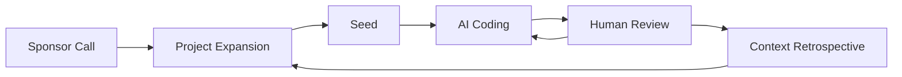

# Agile Vibe Coding (AVC)

**A framework for managing agent-based software development projects**


Agile Vibe Coding (AVC) is a structured approach to consistent long-term software development with AI agents. 


## The Challenge

Large software projects stress LLM-based coding agents in ways that differ fundamentally from how human development teams operate. Unlike humans, which retain long-term memory and build overall abstract understanding through iteration, LLMs do not have these capacities. 

- LLMs are probabilistic and sensitive to prompt formulation.
- LLM's context should not be understood as a memory but as information.
- When context exceeds a model's effective range, coherence degrades.
- The linear predictive nature of LLMs enforces sequential reasoning, limiting native parallel deliberation.

Left unguided, AI coding agents drift. Context decays. Abstractions fracture. Logic duplicates. Regressions surface across independently generated features. 

These are not defects of the models, but natural consequences of bounded context, ephemeral reasoning, and probabilistic generation operating without the persistent internal understanding that humans develop over time.

Can we still build large, complex systems with LLMs despite these constraints? Yes. By shaping context, constraints, and verification through deliberate frameworks and disciplined practice, we guide LLMs toward coherent outcomes. Where models lack persistent understanding, we supply externalized knowledge through a framework: where reasoning is ephemeral, we anchor it in artifacts. 

Let's call it **the Agile Vibe Coding framework**.

## The Agile Vibe Coding Framework

AVC provides a hierarchy of assets, workflows, agents and best practices for handling the common challenges of sustained software delivery using LLMs.

### AVC Assets Hierarchy

AVC gets inspired by the Agile project management best practices and uses the same work hierarchy (Epic → Story → Task → Subtask) adding context boundaries.

```
project/
├── doc.md                                    # documentation
├── context.md                                # context scope                                                             
└── context-0001/   
    ├── doc.md                                # documentation                          
    ├── context.md                            # context scope
    ├── work.json                             # work item (e.g. EPIC)
    └── context-0001-0001/                    
        ├── doc.md                            # documentation                          
        ├── context.md                        # context scope
        ├── work.json                         # work item (e.g. STORY)                     
        └── context-0001-0001-0001/           
            ├── doc.md                        # documentation                          
            ├── context.md                    # context scope
            ├── work.json                     # work item (e.g. TASK)                     
            ├── context-0001-0001-0001-0001/  
            │   ├── doc.md                    # documentation
            │   ├── context.md                # context scope
            │   └── work.json                 # work item (e.g. SUBTASK)
            └── context-0001-0001-0001-0002/
                ├── ...
```

### Context Scopes (context.md files)

Context in AVC is the minimal set of information required for LLM models to properly imnplement the work item (in singular) closer to it. 

### Documentation Scopes (doc.md files)

A documentation item is the human readeable documentation related to the work item closer to it.

### Work Item

Work items defines what needs to get done and the list of tests for work validation.

```json
{
  "id": "context-0001-0001-0001-0001",
  "name": "Create JWT Payload Interface",
  "dependencies": [],
  "prompt": "Create TypeScript interface for JWT payload in src/types/JWTPayload.ts. Include properties: userId (string), email (string), role ('user' | 'admin' literal type), exp (number), iat (number). Add JSDoc comments. Export as named interface.",
  "statuses": [{
    "status": "pending",
    "timestamp": 1769442717798
  }],
  "validation": {
    "status": "pending",
    "tests": [{
      "status": "pending",
      "testPrompt": "Verify JWTPayload interface is properly exported with all required properties and correct types.",
      "validations": [{
        "criteria": "Interface exported from src/types/JWTPayload.ts",
        "status": "pending"
      }, {
        "criteria": "All 5 properties exist with correct types",
        "status": "pending"
      }, {
        "criteria": "TypeScript compiles without errors",
        "status": "pending"
      }]
    }],
    "allTestsPassed": false
  },
  "completedAt": null
}
```

### Work Item Statuses

Work items progress through the following status values as they move through the AVC workflow:

| Status | Description | Ceremonies | When |
|--------|-------------|-------------|------------------------|
| **planned** | Work item created with an initial definition | **Sprint Planning**   | During Epic/Story creation from questionnaire |


| **ready** | Work item fully defined with acceptance criteria, ready for decomposition | **Backlog Refinement ceremony** (future) | After manual refinement with detailed acceptance criteria |
| **pending** | Work item decomposed into children OR is a leaf node ready for implementation | **Project Expansion ceremony** (AI agents) | When decomposing Stories → Tasks → Subtasks |
| **implementing** | Work item currently being coded by AI agents | **AI Coding agents** (server, client, infra, testing) | During active implementation |
| **testing** | Code implemented, running validation tests | **Testing agents** | After implementation completes, test suites executing |
| **implemented** | Code and tests completed, awaiting final validation | **Testing agents** | After all tests pass successfully |
| **completed** | All work done, validated, tests passed, parent dependencies met | **Validation process** | After all validations and parent checks pass |

## Implementation Flow

Work items follow a **bottom-up implementation strategy** through the tree hierarchy. **Leaf nodes** (deepest subtasks) are implemented and validated first, then their parent nodes can begin.

**Implementation Rules:**

1. **Depth-first execution** - Start with the deepest atomic work items (leaf nodes) in each branch
2. **Upward propagation** - A parent node cannot start until all its child nodes are `completed` and tests pass
3. **Parallel execution** - Only **sibling nodes** (work items at the same level under different parents) can be implemented in parallel


**Example execution order:**
```
context-0001/                          # Epic
├── context-0001-0001/                 # Story
│   ├── context-0001-0001-0001/        # Task
│   │   ├── context-0001-0001-0001-0001/  ← 1. Implement first (atomic subtask)
│   │   └── context-0001-0001-0001-0002/  ← 1. Parallel with sibling -0001
│   │   # Task starts only after both subtasks complete ↑
│   └── context-0001-0001-0002/        ← 2. Parallel with sibling task -0001
│   # Story starts only after both tasks complete ↑
└── context-0001-0002/                 ← 2. Parallel with sibling story -0001
    # Epic completes only after both stories complete ↑
```

### Context Inheritance

Each level in the hierarchy has a `context.md` file that **inherits from its parent and adds specifics**. When implementing a work unit, agents read ALL context files from project down to current level.

An example:

```
project/
├── doc.md                  # Level 1: Project documentation
├── context.md              # Level 1: Project  :: Language: TypeScript 5.0 [...]
└── context-0001/           # Epic
    ├── doc.md              # Level 2: Epic documentation
    ├── context.md          # Level 2: Epic     :: All passwords MUST be hashed [...]
    ├── work.json           # Epic work item
    └── context-0001-0001/  # Story
        ├── doc.md          # Level 3: Story documentation
        ├── context.md      # Level 3: Story    :: Password minimum 8 characters [...]
        ├── work.json       # Story work item
        └── context-0001-0001-0001/  # Task
            ├── doc.md      # Level 4: Task documentation
            ├── context.md  # Level 4: Task     :: pattern -> class JWTService { [...]
            └── work.json   # Task work item
```

**When an agent implements task `context-0001-0001-0001`, it reads ALL five context.md files (project + epic + story + task) as the complete context.**


### Tests (Upward Validation)

While context flows DOWN (project → subtask), **tests flow UP** (subtask → project) and each level validates a different granularity, which naturally should flow into the following test hierarchy:

```
Subtask Tests  → Unit Tests        (atomic work)
Task Tests     → Integration Tests (subtasks working together)
Story Tests    → E2E Tests         (user capability end-to-end)
Epic Tests     → System Tests      (domain-wide functionality)
```

Deepest level tests must pass first. Only when all subtask tests pass do you run task tests. Only when all task tests pass do you run story tests,etc.. 


## AVC Ceremonies

As with Agile project management, the Agile Vibe Coding framework contains a set of ceremonies and processes to manage the project moving forward.



### **Sponsor Call**

The first ceremony that creates the project foundation through an interactive questionnaire. Generates project documentation and architectural context that serves as the foundation for all subsequent work.

**Key Features:**
- 5-question interactive questionnaire with AI-powered suggestions
- Generates comprehensive project documentation (doc.md)
- Creates project-level architectural context (context.md)
- Auto-save and resume capability
- Foundation for Epic/Story decomposition

**Output:**
- `.avc/project/project/doc.md` - 8-section project documentation
- `.avc/project/project/context.md` - Project-level architectural context (~500 tokens)

**[📖 Read Full Documentation](/ceremonies/sponsor-call.md)**

---

### **Project Expansion**

Creates or expands project Epics and Stories with intelligent duplicate detection. Decomposes project scope into domain-based Epics (3-7) and user-facing Stories (2-8 per Epic) with proper context inheritance.

**Key Features:**
- Duplicate detection - skips existing Epics/Stories
- ID renumbering to avoid collisions
- Generates Epic and Story context.md files
- Incremental expansion support
- Context inheritance from project level

**Output:**
- Epic directories: `context-XXXX/` with doc.md, context.md (~800 tokens), work.json
- Story directories: `context-XXXX-XXXX/` with doc.md, context.md (~1500 tokens), work.json

**[📖 Read Full Documentation](/ceremonies/project-expansion.md)**

---

### **Seed**

Decomposes a Story into Tasks (2-5) and Subtasks (1-3 per Task) for implementation. Creates atomic work units with complete context inheritance from Story, Epic, and Project levels.

**Key Features:**
- Story-level decomposition into technical Tasks
- Task categories: backend, frontend, database, testing, infrastructure
- Atomic Subtasks (1-4 hours each)
- Generates Task and Subtask context.md files
- Updates Story work.json with Task children

**Output:**
- Task directories: `context-XXXX-XXXX-XXXX/` with doc.md, context.md (~1200 tokens), work.json
- Subtask directories: `context-XXXX-XXXX-XXXX-XXXX/` with doc.md, context.md (~800 tokens), work.json

**Usage:** `/seed <story-id>` (e.g., `/seed context-0001-0001`)

**[📖 Read Full Documentation](/ceremonies/seed.md)**

---

### **AI Coding** - Implementation

**Status:** 🚧 **Under Development**

Autonomous implementation of atomic work units by specialized AI agents. Generates code, tests, and documentation based on context from all parent levels.

**Key Features:**
- Specialized agents (Server, Client, Infrastructure, Testing)
- Context-aware implementation
- Automated testing and validation
- Human review gate before completion

**[📖 Read Full Documentation](/ceremonies/ai-coding.md)**

---

### **Context Retrospective** - Learning & Refinement

**Status:** 🚧 **Under Development**

Updates all context scopes based on learnings from implementation. Ensures AI agents have accurate, up-to-date context for future work by capturing architectural decisions, domain knowledge, and technical insights.

**Key Features:**
- Analyzes completed work for insights
- Updates context.md files at all levels
- Maintains context inheritance
- Tracks architectural decisions and patterns

**[📖 Read Full Documentation](/ceremonies/context-retrospective.md)**


## Multi-Provider LLM Support

AVC supports **different LLM providers for each ceremony**, allowing you to optimize for cost, speed, or quality based on ceremony-specific requirements.

### Configuration

**File:** `.avc/avc.json`

```json
{
  "settings": {
    "ceremonies": [
      {
        "name": "sponsor-call",
        "provider": "claude",
        "defaultModel": "claude-sonnet-4-5-20250929"
      },
      {
        "name": "project-expansion",
        "provider": "gemini",
        "defaultModel": "gemini-2.0-flash-exp"
      }
    ]
  }
}
```

### Supported Providers

- **Claude** (Anthropic) - Best for long-form documentation, complex reasoning, structured thinking
- **Gemini** (Google) - Fast and cost-effective for iteration-heavy tasks

### API Keys

Set in `.env` file:

```bash
# Claude (Anthropic)
ANTHROPIC_API_KEY=sk-ant-...

# Gemini (Google)
GEMINI_API_KEY=...
```

### Switching Providers

Edit `.avc/avc.json` to change the provider for any ceremony:

```json
{
  "ceremonies": [
    {
      "name": "sponsor-call",
      "provider": "gemini",  // Changed from "claude"
      "defaultModel": "gemini-2.0-flash-exp"
    }
  ]
}
```

Then ensure the corresponding API key is set in `.env`.


## **AI Agent Strategy: Single Prompt Approach**

AVC uses a **single prompt strategy** where agent instructions and task data are combined into one user message, rather than separating them into system instructions and user prompts.

**What is the Single Prompt Approach?**
- Agent role definitions (from `src/cli/agents/*.md` files) are prepended to task-specific data
- Both are sent together as a single user message to the LLM
- System instructions are reserved only for generic behavior (e.g., "return valid JSON")

**Why We Chose This Strategy:**

1. **Research Evidence**: Studies show LLMs experience 40-80% performance degradation when combining knowledge retrieval with instruction-following in separate channels ([arXiv:2410.12972](https://arxiv.org/html/2410.12972v2)). Processing agent role and task data together in unified context eliminates this split-attention problem.

2. **Explicit Role Establishment**: By placing agent instructions FIRST in the prompt, the model fully internalizes its role before processing task data. This reduces role confusion and improves output consistency.

3. **Better Validation**: The model can reference agent rules throughout generation, leading to better adherence to constraints like output formats and domain-specific requirements.

4. **Provider Agnostic**: Works identically across Claude (Anthropic) and Gemini (Google) APIs without provider-specific workarounds.

5. **Empirical Results**: Testing showed significantly better Epic/Story decomposition and context generation quality compared to system instruction approach.

**AI Agent Templates** (`src/cli/agents/`):
- `documentation.md` (303 lines) - 8-section document structure, technology-specific output, hierarchical documentation
- `decomposition.md` (143 lines) - Domain-driven design rules, Epic/Story decomposition strategy, dependency management
- `context-generator.md` (264 lines) - Layered specificity templates, concrete implementation details

**Implementation Pattern** (works for both Claude and Gemini):
```javascript
// Single prompt: Agent instructions + Task data
const fullPrompt = `${agentInstructions}\n\n${taskPrompt}`;

// Claude API - agent in user message, not system
await anthropic.messages.create({
  system: 'You are a helpful assistant that returns valid JSON.',  // Minimal generic behavior
  messages: [{ role: 'user', content: fullPrompt }]  // Agent role + task together
});

// Gemini API - agent in contents, not systemInstruction
await googleAI.models.generateContent({
  contents: fullPrompt,  // Agent role + task together
  generationConfig: { responseMimeType: 'application/json' }
});
```

**Trade-offs:**
- ✅ **Pro**: 40-80% improvement in instruction-following accuracy
- ✅ **Pro**: Better role consistency and validation adherence
- ✅ **Pro**: Provider-agnostic implementation
- ⚠️ **Con**: Higher resource usage per agent call
- ⚠️ **Con**: Instruction redundancy across multiple API calls

**Decision**: For complex ceremony tasks (project decomposition, context generation), the quality improvement justifies the approach.

**Context Accumulation**: Each AI suggestion uses all previously collected answers as context. The system builds understanding progressively - later suggestions are more informed than earlier ones.


---

## References

1. **Anthropic's Best Practices for Long-Running Agents** - [Effective Harnesses for Long-Running Agents](https://www.anthropic.com/engineering/effective-harnesses-for-long-running-agents) - Agents working across multiple context windows need structured environments with initializer agents to set up foundations and coding agents that maintain clean, documented code states for handoffs between sessions.

2. **Microservices Architecture** - [Microservices Patterns](https://microservices.io/patterns/microservices.html) - Structures applications as loosely coupled, deployable components organized around business capabilities, enabling teams to develop, test, and deploy services independently while maintaining system flexibility and scalability.

3. **Agile Manifesto** - [Agile Principles](https://agilemanifesto.org/principles.html) - Prioritizes delivering functional software rapidly while remaining responsive to changing customer needs through continuous collaboration and team empowerment.

4. **LLM Limitations Research** - [https://arxiv.org/html/2410.12972v2](https://arxiv.org/html/2410.12972v2) - Large language models exhibit significant weakness in combining knowledge and instruction-following, with performance drops of 40-80% when given simple answer-modifying instructions alongside knowledge tasks.


